# 1장 오브젝트와 의존 관계

## 🌿 DAO의 분리

### 🌱 관심사의 분리

객체지향의 세계에서는 오브젝트에 대한 설계와 이를 구현한 코드가 끊임없이 변한다. <br>
→ 그러므로 개발자는 미래의 변화에 대비하는 개발을 실천해야 한다.
<br>

객체지향이 초기에 더 많고 번거로운 작업을 요구하는 이유가 바로 변화에 효과적으로 대처할 수 있다는 기술적인 특징 때문이다!<br>

그렇다면 변화를 어떻게 대비할 것인가? <br>

> 변화의 폭을 최소한으로 줄여주어야 한다! <br>
> → 이것은 **분리와 확장을 고려한 설계를 기반**으로 대비할 수 있다!

모든 변경과 발전은 **한 번에 한 가지 관심사항**에 집중해서 일어난다.
그러므로 우리는 **한 가지 관심이 한 군데에 집중**되게 하도록 설계해야 한다.

> 즉, 관심이 같은 것 끼리는 모으고 관심이 다른 것은 따로 떨어져 있게 하는 것. <br> > **"관심사의 분리"**!!

<br>

관심사의 분리 in 객체지향?

1. 관심이 같은 것 끼리는 하나의 객체 or 친한 객체로 모이게
2. 관심이 다른 것은 가능한 한 따로 떨어져서 서로 영향을 주지 않도록 분리함.

### 🌱 커넥션 만들기의 추출

UserDao를 수정하기

#### 중복 코드의 메소드 추출

현재 Connection을 가져오는 코드가 여러 메소드에서 중복되고 있음.

- getConnection() 메소드로 따로 추출하여 중복을 제거한다!
  - DB 접속 방식 혹은 Driver 클래스와 URL이 바뀌었을 때 능동적인 대처가 가능하다.

→ 즉 관심의 종류에 따라 코드를 구분해놓았기 때문에 한 가지 관심에 대한 변경이 일어날 경우, 그 관심이 집중되는 부분의 코드만 수정하면 된다!

<br>

위 작업에 대한 결과로 기능에 대한 영향 없이 코드 구조를 깔끔하게 변경하였다. <br>
이 과정을 우리는 **리팩토링** 이라고 한다.

> **리팩토링** <br>
> 기존의 코드를 외부의 동작 방식에는 변환 없이 내부 구조를 변경해서 재구성하는 작업 또는 기술을 말함.

### 🌱 DB 커넥션 만들기의 독립

#### 상속을 통한 확장

기존 UserDao 내부 소스코드를 공개하지 않고, 고객 스스로 DB 커넥션 생성 방식을 적용해가면서 UserDao를 사용하게 해보자. <br>
방법은 기존의 UserDao 코드를 한 단계 더 분리하면 된다.

1. getConnection()의 구현 코드를 제거하여 추상 메소드로 만든다.
2. 각각의 고객은 UserDao를 상속한 서브클래스를 생성하여 getConnection()을 원하는 방식대로 구현하여 사용한다.

<br>

- 다음과 같이 DB 커넥션 연결이라는 관심을 이번에는 상속을 통해 서브클래스로 분리해버리는 것이다!

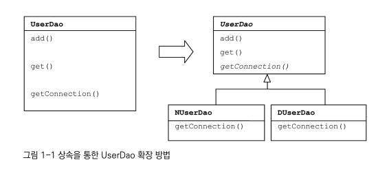

<br>

<table>
    <tr>
        <th>UserDao의 관심</th>
        <th>UserDao의 서브클래스의 관심</th>
    </tr>
    <tr>
        <td>어떻게 데이터를 등록하고 가져올 것인가?</td>
        <td>DB 연결 기능에 대한 관심을 포함함.</td>
    </tr>
</table>

> **템플릿 메소드 패턴** <br>
> 슈퍼클래스에 기본적인 로직의 흐름을 만들고, 그 기능의 일부를 추상 메소드나 오버라이딩이 가능한 protected 메소드 등으로 만든 뒤, <br>
> 서브 클래스에서 이런 메소드를 필요에 맞게 구현해서 사용하도록 하는 방법(패턴)!

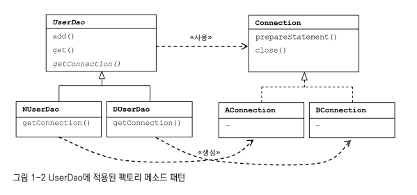

<br>

NUserDao와 DUserDao에서 생성하는 Connection 오브젝트의 구현 클래스는 차이가 날 것!

- 각각 NUserDao는 → AConnection (implements Connection)
- DUserDao는 → BConnection 클래스를 구현해서 사용할 것임.

다만 UserDao 클래스는 Connection interface 에만 관심을 두고, Connection에 정의된 메소드를 사용함. **Connection 내부 동작 방식과는 상관 없이 필요한 기능을 인터페이스를 통해 사용**하는 것! <br>
반대로 NUserDao와 DUserDao의 관심 사항은 어떻게 Connection 오브젝트 생성과 연결 기능 제공이 되는지에 대해 관심을 두고 있음. <br>

### 🌱 상속 사용의 문제점

만약 이미 UserDao가 다른 목적을 위해 상속을 사용하고 있다면?

- 다른 목적으로 상속 적용이 어려움.

<br>

또한, 상속 관계는 생각보다 밀접함.

- 슈퍼클래스 내부 변경은 모든 서브 클래스 변경을 야기함.
  - 이걸 막기 위해 슈퍼 클래스의 변화를 막는 제약을 가하게 될 수도..

<br>

확장된 기능인 DB 커넥션 생성 코드를 다른 DAO 클래스에 적용할 수 없다는 것도 큰 단점임.

- UserDao외의 다른 DAO 클래스들이 계속 만들어진다면? DB 커넥션 생성 코드 (getConnection() 메서드)는 모든 Dao 클래스에서 중복되어 나타날 것!

## 🌿 DAO의 확장

### 🌱 클래스의 분리

관심사를 메소드가 아닌 아예 독립적인 클래스로 분리시킨다!

- 한 번만 SimpleConnectionMaker 오브젝트를 생성하여 저장해두고 계속 사용한다!

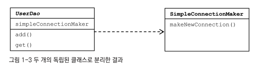

<br>

But, 다른 문제 발생!

- UserDao의 코드가 `SimpleConnectionMaker`라는 특정 클래스에 종속되어버리면서 connection 기능 확장장이 불가능해졌다!

<br>

우리가 해결해야 할 문제

- UserDao가 바뀔 수 있는 정보, 즉 DB 커넥션을 가져오는 클래스에 대해 너무 많이 알고 있음.
  - 그러므로 고객이 DB 커넥션을 자유롭게 확장하기 위해 다른 클래스를 구현하려면 어쩔 수 없이 UserDao 자체를 다시 수정해야 함.

### 🌱 인터페이스의 도입

추상화 작업을 해보자!

- 추상화: 어떤 것들의 공통적인 성격을 뽑아내어 이를 따로 분리해내는 작업.

  - 인터페이스로 추상화해놓은 최소한의 통로를 통해 접근? 오브젝트를 만들 때 사용할 클래스가 무엇인지 몰라도 됨!

    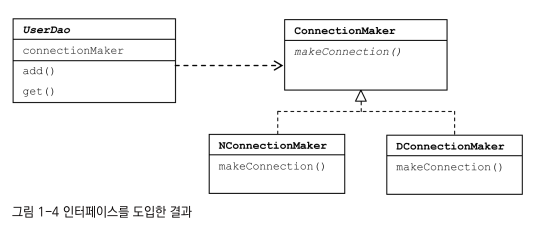

### 🌱 관계설정 책임의 분리

하지만 여전히 UserDao에는 어떤 Connection 구현 크래스를 사용할지 결정하는 코드가 남아있다.

- UserDao의 클라이언트에서 UserDao를 사용하기 전에, 먼저 UserDao가 어떤 ConnectionMaker의 구현 클래스를 사용할지를 결정하도록 만들어주자!

<br>

UserDao 오브젝트가 사용할 구현 클래스를 **메소드 파라미터** 혹은 **생성자 파라미터**를 이용하여 전달해준다!

> 객체 지향의 **다형성 특징을 사용**한다!

클래스 사이의 관계 X, 오브젝트 사이의 다이내믹한 관계가 만들어지는 것.

- 클래스 사이의 관계: 코드에 다른 클래스 이름이 나타나면서 만들어짐.
- 오브젝트 사이의 관계
  - 코드에서는 특정 클래스를 전혀 알지 못함.
  - 다만 해당 클래스가 구현한 인터페이스를 사용하여 해당 클래스를 인터페이스 타입으로 받아 사용하는 것!

#### 책임을 클라이언트로 떠넘기자!

다음과 같이 userDao client가 구체적인 클래스를 생성하여 UserDao의 생성자로 넣어주게 되는 것이다!

- UserDao와 ConnectionMaker 구현 클래스와의 런타임 오브젝트 의존 관계 설정 책임을 담당하게 되는 것.
  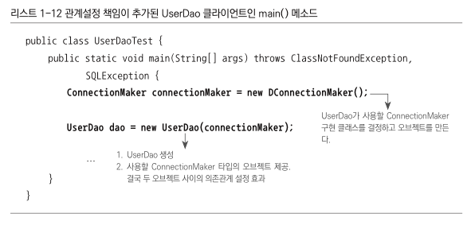

<br>

UserDaoTest가 추가된 구조는 다음과 같다.

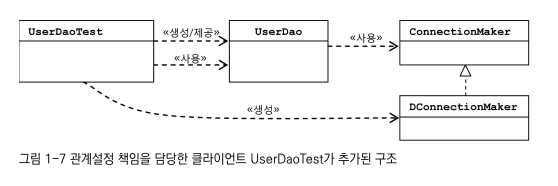

### 🌱 원칙과 패턴

#### 개방 폐쇄 원칙

클래스와 모듈은 확장에는 열려 있어야 하고 변경에는 닫혀 있어야 한다!

#### 높은 응집도와 낮은 결합도

- 응집도가 높다는 것?
  - 하나의 모듈, 클래스가 하나의 책임 또는 관심사에만 집중되어 있따는 것.
  - 하나의 공통 관심사는 한 클래스에!
- 낮은 결합도?
  - 책임과 관심사가 다른 오브젝트 또는 모듈과는 느슨하게 연결된 형태를 유지해야 한다.
  - 느슨한 결합
    - 관계를 유지하는 데 꼭 필요한 최소한의 방법만 간접적인 형태로 제공. <br>
      나머지는 서로 독립적이고 알 필요도 없게 만들어 주는 것.

#### 전략 패턴

자신의 기능 맥락(context)에서, 필요에 따라 변경이 필요한 알고리즘을 인터페이스를 통해 통째로 외부로 분리시키고, 이를 구현한 구체적인 알고리즘 클래스를 필요에 따라 바꿔서 사용할 수 있게 하는 디자인 패턴.

## 🌿 제어의 역전(IoC)

### 🌱 오브젝트 팩토리

현재 UserDaoTest는 UserDao의 기능 동작 테스트 뿐 만 아니라, ConnectionMaker의 구현 클래스를 결정하는 역할까지 떠맡음.

한 가지씩 역할을 맡아야 하기 때문에,

- UserDao와 ConnectionMaker 구현 클래스의 오브젝트를 만드는 것
- 두 개의 오브젝트가 연결되어 사용될 수 있또록 관계를 맺어주는 것

이 기능들을 분리해주자!

#### 팩토리

팩토리 클래스의 역할: 객체의 생성 방법을 결정하고 그렇게 만들어진 오브젝트를 돌려주는 것.

- 여기서는 UserDaoTest 내부의 UserDao, ConnectionMaker 관련 생성 작업을 맡는다!

```java

/**
 * 다음과 같이 팩토리의 메소드는 UserDao 타입의 오브젝트를
 * 어떻게 만들고, 어떻게 준비시킬지를 결정함.
**/

public class DaoFactory{
    public UserDao userDao() {
        ConnectionMaker connectionMaker = new DConnectionMaker();
        UserDao userDao = new UserDao(connectionMaker);
        return userDao;
    }
}
```

#### 설계도로서의 팩토리

- 어떤 오브젝트가 어떤 오브젝트를 사용하는지 보임.

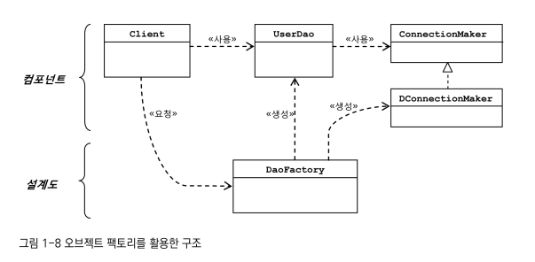

<br>

역할과, 관계를 분석해보자

<table>
    <tr>
        <th>UserDao</th>
        <th>ConnectionMaker</th>
        <th>DaoFactory</th>
    </tr>
    <tr>
        <td>어떻게 데이터를 등록하고 가져올 것인가?</td>
        <td>어떻게 DB에 연결할 것인가?</td>
        <td>오브젝트들을 어떻게 구성하고, 그 관계를 정의할 것인가?</td>
    </tr>
</table>

### 🌱 오브젝트 팩토리의 활용

- UserDao가 아닌 다른 DAO의 생성 기능을 DaoFactory에 넣게 된다면?
  - 다음과 같이 ConnectionMaker 구현 클래스를 선정하고 생성하는 코드가 중복되게 됨.

```java
public class DaoFactory{
    public UserDao userDao() {
        ConnectionMaker connectionMaker = new DConnectionMaker(); // 중복
        UserDao userDao = new UserDao(connectionMaker);
        return userDao;
    }

    public AccountDao accountDao() {
        ConnectionMaker connectionMaker = new DConnectionMaker();// 중복
        AccountDao accountDao = new AccountDao(connectionMaker);
        return accountDao;
    }

    public MessageDao messageDao() {
        ConnectionMaker connectionMaker = new DConnectionMaker();// 중복
        MessageDao messageDao = new MessageDao(connectionMaker);
        return messageDao;
    }
}
```

#### 중복 제거하기

```java
public class DaoFactory{
    public UserDao userDao() {
        return new UserDao(connectionMaker());
    }

    public AccountDao accountDao() {
        return new AccountDao(connectionMaker());
    }

    public MessageDao messageDao() {
        return new MessageDao(connectionMaker());
    }

    public ConnectionMaker connectionMaker() {
        return new DConnectionMaker();
    }
}
```

### 🌱 제어권의 이전을 통한 제어관계 역전

제어의 역전? 프로그램 제어 흐름 구조가 뒤바뀌는 것!

- 오브젝트는 자신이 사용할 오브젝트를 스스로 선택하지 않음. + 당연히 생성하지도 않음.
- 자신이 어떻게 만들어지고, 어떻게 사용되는지도 알지 못함.
  - 모든 제어 권한을 다른 대상에게 위임하기 때문.

→ main() 과 같은 엔트리 포인트를 제외하고, 모든 오브젝트는 이렇게 **위임받은 제어 권한을 갖는 특별한 오브젝트에 의해 결정되고 만들어짐**.

## 🌿 스프링의 IoC

### 🌱 오브젝트 팩토리를 이용한 스프링의 IoC

#### 애플리케이션 컨텍스트와 설정정보

Spring Bean: 스프링이 제어권을 가지고 직접 만들고 관계를 부여하는 오브젝트.

- 스프링 컨테이너가 생성과 관계 설정, 사용 등을 제어해주는 "제어의 역전이 적용된 오브젝트"

<br>

Bean Factory: 빈의 생성과 관계설정 같은 제어를 담당하는 IoC 오브젝트

- 하지만 보통 이보다 확장된 application context를 주로 사용한다고.

<br>

Application Context: 별도의 정보를 참고해서 빈의 생성, 관계설정 등의 제어 작업을 총괄하는 것.

#### DaoFactory를 사용하는 애플리케이션 컨텍스트

DaoFactory를 스프링의 빈 팩토리가 사용할 수 있는 본격적인 설정정보로 만들어보자.

- @Configuration: 빈 팩토리를 위한 오브젝트 설정을 담담당하는 클래스라고 인식하게 해줌.
- @Bean: 오브젝트를 만들어주는 메소드에 붙임.

```java

@Configuration // 애플리케이션 컨텍스트가 사용할 설정정보라는 표시
public class DaoFactory {
    @Bean // 오브젝트 생성을 담당하는 IoC용 메소드: 메소드 이름 = 빈의 이름이 됨.
    public UserDao userDao() {
        return new UserDao(connectionMaker());
    }

    @Bean
    public ConnectionMaker connectionMaker() {
        return new DConnectionMaker();
    }
}

```

<br>
이렇게 고쳐주면 UserDaoTest에서는 다음과 같이 수정하여 동작시킨다.

- `AnnotationConfigApplicationContext` 를 이용하여 `@Configuration`이 붙은 자바 코드를 설정 정보로 사용할 수 있다.
- getBean() 메소드를 통해 UserDao의 오브젝트를 가져올 수 있다.
  - getBean()? ApplicationContext가 관리하는 오브젝트를 요청하는 메소드.
- userDao라는 이름의 빈을 가져온다는 것 = DaoFactory의 userDao() 메소드를 호출해서 그 결과를 가져오는 것!!

```java
public class UserDaoTest {
    public static void main(String[] args) throws ClassNotFoundException,   SQLException {
        ApplicationContext context = new AnnotationConfigApplicationContext(DaoFactory.class)
        UserDao dao = context.getBean("userDao", UserDao.class)
    }
}

```

### 🌱 애플리케이션 컨텍스트의 동작방식

- 오브젝트 팩토리가 스프링의 애플리케이션 컨텍스트에 대응 됨.

  - application Context = Spring IoC Container = Spring Container = Bean Factory

- Application Context는 애플리케이션에서 IoC를 적용해서 관리할 모든 오브젝트에 대한 생성과 관계 설정을 담당함.

  - 직업 오브젝트 생성 + 관계를 맺어주는 코드가 있는 게 아님.
  - 연관관계 정보를 **별도의 설정정보**를 통해 얻음.

- 이 때 "별도의 설정정보" 가 바로 `@Configuration`이 붙은 것!!

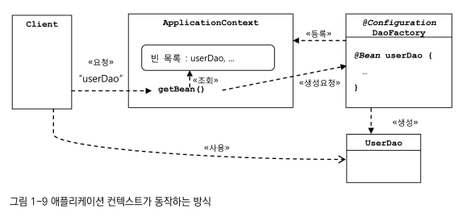

#### 오브젝트 팩토리와 비교했을 때, 애플리케이션 컨텍스트를 사용하면 얻을 수 있는 장점

1. 클라이언트는 구체적인 팩토리 클래스를 알 필요가 없음.
   - 일관된 방식의 원하는 오브젝트도 얻을 수 있음.
2. 종합 IoC 서비스를 제공해줌.
   - 오브젝트 사이의 관계 설정 뿐 만 아니라, 오브젝트를 효과적으로 활용할 수 있는 다양한 기능 제공
     - 오브젝트가 만들어지는 방식, 시점과 전략 설정
     - 자동생성, 오브젝트에 대한 후처리, 정보의 조합, 설정 방식의 다변화, 인터셉팅 등
3. 빈을 검색하는 다양한 방법을 제공함.

### 🌱 스프링 IoC의 용어 정리

#### 빈

스프링이 IoC 방식으로 관리하는 오브젝트. <br>
즉, 관리되는 오브젝트

- 스프링이 직접 그 생성과 제어를 담당하는 오브젝트.

#### 빈 팩토리

스프링의 IoC를 담당하는 핵심 컨테이너. <br>
빈을 관리하는 기능을 담당함.

- 빈 등록/생성/조회/반환 등

#### 애플리케이션 컨텍스트

빈 팩토리를 확장한 IoC 컨테이너. <br>
빈 팩토리의 기능에서 스프링이 제공하는 각종 부가 서비스를 추가적으로 제공함.

#### 설정정보/설정 메타정보

애플리케이션 컨택스트 혹은 빈 팩토리가 IoC를 적용하기 위해 사용하는 메타정보.

- IoC 컨테이너에 의해 관리되는 애플리케이션 오브젝트를 생성하고 구성할 때 사용함.

#### 컨테이너 또는 IoC 컨테이너

IoC 방식으로 빈을 관리하는 것. 애플리케이션 컨텍스트나 빈 팩토리를 컨테이너 혹은 IoC 컨테이너라고 함. <br>
대신 애플리케이션 컨텍스트보다 좀 더 추상적인 표현임.

## 🌿 싱글톤 레지스트리와 오브젝트 스코프

#### DaoFactory의 userDao()를 여러 번 호출했을 때!

- 오브젝트 팩토리 방식: 매번 각각 다른 UserDao 객체가 출력됨.
- 스프링 애플리케이션 컨텍스트 방식: **매번 같은** UserDao 객체가 출력됨.
  - 매번 new 에 의해 새로운 UserDao가 만들어지지 않는다는 것!

### 🌱 싱글톤 레지스트리로서의 애플리케이션 컨텍스트

애플리케이션 컨텍스트 = IoC 컨테이너 ,.. <br>
동시에 싱글톤을 저장하고 관리하는 **싱글톤 레지스트리**인 것!

스프링은 별다른 설정을 하지 않으면 내부에서 생성하는 빈 오브젝트는 모두 싱글톤으로 생성함.

#### 서버 애플리케이션과 싱글톤

왜 싱글톤으로 빈을 만드는 것일까?

- 스프링은 주로 **자바 엔터프라이즈 기술을 사용하는 서버 환경**에 주로 적용되기 때문!

<br>

예를 들어 클라이언트에서 요청이 올 때마다 각 로직을 담당하는 오브젝트를 새로 만든다고 가정해보자. 아무리 Java의 Object 생성과 Garbage Collection의 성능이 좋아졌더라도 이런 부하는 서버가 감당할 수 없다. <br>
→ 그러므로 엔터프라이즈 분야에서는 "서비스 오브젝트" 개념을 일찍부터 사용해왔다!

<br>

Servlet = 서비스 오브젝트 (자바 엔터프라이즈 기술의 가장 기본)

- 서블릿은 대부분의 멀티스레드 환경에서 싱글톤으로 동작함.
- 서블릿 클래스 당 하나의 오브젝트만 생성. **사용자의 요청을 담당하는 여러 스레드에서 하나의 오브젝트를 공유해 동시에 사용**함!

#### 싱글톤 패턴의 한계

하지만 싱글톤 패턴이 무조건 좋은 건 아님.

일반적으로 자바에서 싱글톤을 구현하는 방법은 다음과 같다.

1. 생성자를 private으로 설정: 새로운 생성을 막음.
2. 생성된 싱글톤 오브젝트를 저장하는 자신과 같은 타입인 static field를 정의
3. getInstance() 를 만들어 이 메소드가 최초로 호출되는 시점에서 한 번만 오브젝트가 만들어지게 함. 생성된 오브젝트는 static field에 저장됨.
4. getInstance()를 통해 이미 만들어져 스태틱 필드에 저장된 오브젝트를 넘겨줌.

<br>

싱글톤 패턴 구현 방식의 문제점

1. private 생성자 때문에 상속할 수 없다.
   - 객체지향의 장점인 상속과 다형성 적용이 불가능함.
2. 테스트하기가 힘들다.
   - 아예 테스트가 불가능할 수도 있다.
   - 만들어지는 방식이 제한적이라 테스트용 오브젝트 대체가 어렵다.
3. 서버환경에서는 싱글톤이 하나만 만들어지는 것을 보장하지 못한다.
   - 서버에서의 클래스 로더 구성에 따라 싱글톤 클래스임에도 하나 이상의 오브젝트가 만들어 질 수도 있다.
4. 싱글톤의 사용은 전역 상태를 만들 수 있기 때문에 바람직하지 못하다.
   - 아무 객체나 자유롭게 접근하고 수정하고 공유할 수 있는 "전역 상태"를 갖는 것은 객체지향 프로그래밍에서는 권장되지 않는 프로그래밍 모델이다.

#### 싱글톤 레지스트리

자바의 기본적인 싱글톤 패턴 구현 방식은 여러 가지 단점이 있음. <br>
따라서 스프링은 직접 싱글톤 형태의 오브젝트를 만들고 관리하는 기능을 제공함. <br>
= **싱글톤 레즈스트리!**

<br>

스프링 컨테이너 = 싱글톤 관리 컨테이너

- 싱글톤을 생성, 관리, 공급함.

<br>

- 싱글톤 레지스트리의 장점
  - 평범한 자바 클래스도 싱글톤으로 활용 가능함.
  - IoC 방식의 컨테이너를 사용해서 생성과 관계 설정, 사용 등에 대한 제어권을 컨테이너에 넘기면 손 쉽게 싱글톤 방식으로 만들어져 관리되게 할 수 있는 것.
  - 평범한 클래스도 public 생성자를 가질 수 있음.
  - 오브젝트 생성이 간단함. 따라서 테스트를 위한 오브젝트 대체가 용이함.

→ 제일 중요한 점? 싱글톤 패턴과 달리 스프링이 지지하는 객체지향적인 설계 방식과 원칙, 디자인 패턴등을 적용하는 데 아무런 제약이 없다는 것!

### 🌱 싱글톤과 오브젝트의 상태

멀티스레드 환경에서 싱글톤은 여러 스레드가 동시에 접근하여 사용할 수 있음. 그러므로 상태 관리에 유의해야 함.

<br>

싱글톤이 멀티스레드 환경이라면 상태 정보를 내부에 갖고 있지 않은 무상태 stateless 방식으로 만들어져야 한다.

- stateful? 서로 값을 덮어쓰고 자신이 저장하지 않은 값을 읽어올 수 있기 때문!
  - 따라서 인스턴스 변수에 **매번 새로운 값으로 바뀌는 정보를 담는 변수를 지정하면 심각한 문제가 발생**한다.
  - 대신 읽기 전용 정보를 담고 있는 인스턴스 변수는 사용 가능하다.

<br>

stateless한 상태에서 각 요청 정보나, DB or 서버의 리소스로부터 생성한 정보는 어떻게 다뤄야 할까?

- 파라미터, 로컬 변수, 리턴 값 등을 사용한다!

  - 메소드 안에서 생성되는 로컬 변수는 매번 새로운 값을 저장할 독립적인 공간이 만들어지기 때문임.

- 클래스 인스턴스 변수로 만약 스프링 빈과 같이 싱글톤 빈을 저장하려는 용도라면 사용해도 괜찮음. <br> : 읽기 전용이고 애초에 오브젝트가 한 개만 만들어지기 때문

### 🌱 스프링 빈의 스코프

빈의 스코프: <br>
스프링이 관리하는 오브젝트, 즉 빈이 생성 / 존재 / 적용되는 범위

<br>

- 빈의 기본 스코프: 싱글톤
  - 컨테이너 내의 한 개의 오브젝트만 생성됨. 스프링 컨테이너가 존재하는 동안 계속 유지되는 것.
- 프로토타입 스코프
  - 컨테이너에 빈을 요청할 때마다 매번 새롱누 오브젝트를 생성함.
- 요청 스코프
  - HTTP 요청이 있을 때마다 생성됨.
- 세션 스코프
  - 웹의 세션과 스코프가 유사.

## 🌿 의존관계 주입(DI)

### 🌱 제어의 역전과 의존관계 주입

스프링의 IoC 컨테이너? 객체를 생성하고 관계를 맺어주는 등의 작업을 담당하는 기능을 일반화한 것.

- 스프링이 제공하는 IoC 방식의 핵심 = **"의존 관계 주입 (Dependency Injection)"**
  - 따라서 스프링 컨테이너가 최근엔 IoC 또는 DI 컨테이너라고 더 많이 불림.

### 🌱 런타임 의존관계 설정

#### 의존관계

의존 관계란? <br>
: 두 개의 클래스가 의존관계가 있다는 것? = 방향성이 부여되어있다는 것.

- 이 그림은 A가 B에 의존하고 있음을 나타냄.
  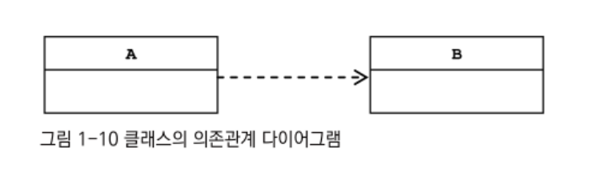

<br>

- 의존하고 있다는 것은 무슨 의미인가?
  - 여기서의 **의존 대상: B가 변하면 그것이 A에 영향을 끼친다**는 것!
  - ex) 사용에 대한 의존관계: A에서 B에 정의된 메소드를 호출해서 사용하는 경우
- 의존관계는 **방향성**이 있다!
  - A는 B에 의존함.
  - B는 A에 의존하고있지 않음.

#### UserDao의 의존관계

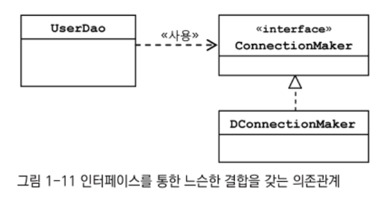

- UserDao가 ConnectionMaker를 사용함. → ConnectionMaker에 의존하고 있음.
  - 따라서 ConnectionMaker이 변하면 UserDao도 직접적인 영향을 받음.
- 하지만 ConnectionMaker를 구현한 DConnectionMaker 등이 다른 것으로 바뀌어도 UserDao에 영향을 주지 않음.
  - UserDao는 DConnectionMaker 라는 클래스 존재도 알지 못함.

→ 이렇게 인터페이스에 대해서만 의존관계를 만들어두면? <br>
인터페이스 구현 클래스와의 관계는 느슨해지는 것. <br>
= 변화에 영향을 덜 받는 상태! <br>
= 결합도가 낮은 상태

<br>

- 런타임 의존관계도 존재한다.
  - 런타임 시에 설계 시점의 의존 관계가 실체화되는 것.
  - 설계 시점에 어떤 클래스로 만든 것인지 미리 알 수 없음.

→ 의존 오브젝트: 오브젝트가 만들어지고 나서 런타임 시에 의존관계를 맺는 대상. 즉 실제 사용대상인 오브젝트!

<br>

#### 의존관계 주입?

의존관계 주입: <br>
구체적인 의존 오브젝트와 그것을 사용할 주체, 오브젝트(클라이언트)를 런타임 시에 연결해주는 작업.

<br>

의존관계 주입의 세가지 조건 <br>
핵심? **설계 시점에서는 알지 못했던 두 오브젝트의 관계를 맺도록 도와주는 제3의 존재가 있다는 것.**

1. 클래스 모델이나 코드에는 런타임 시점의 의존관계가 드러나지 않는다. 그러기 위해서는 인터페이스에만 의존하고 있어야 한다.
2. 런타임 시점의 의존관계는 컨테이너나 팩토리 같은 제3의 존재가 결정한다.
3. 의존관계는 사용할 오브젝트에 대한 레퍼런스를 외부에서 제공(주입)해줌으로써 만들어진다.

→ 스프링에서는 Application Context, Bean Factory, IoC Container 등이 제3의 존재(외부에서 오브젝트 사이의 런타임 관계를 맺어주는 책임을 지님.)

그러므로 여기서 Connection과 UserDao의 런타임 의존관계를 관리하는 DaoFactory는 IoC 컨테이너 인 것. <br>
= 런타임 의존관계 설정, 의존관계 주입 작업 주도 <br>
= IoC 방식으로 오브젝트의 생성과 초기화, 제공 등의 작업을 수행하는 컨테이너 <br>
= DI 컨테이너

<br>

DI 컨테이너는 자신이 결정한 의존관계를 맺어줄 클래스의 오브젝트를 만들고 이 생성자의 파라미터로 오브젝트의 레퍼런스를 전달한다.

```java
public class UserDto{
    private ConnectionMaker connectionMaker;

    // DI 의존관계 주입
    public UserDto(ConnectionMaker connectionMaker) {
        this.connectionMaker = connectionMaker;
    }

    ...

}

```

→ 자신이 사용할 오브젝트에 대한 선택과 생성 제어권을 외부로 넘기고, <br>
자신은 수동적으로 주입받은 오브젝트를 사용함.

### 🌱 의존관계 검색과 주입

의존관계 검색: 자신이 필요로 하는 의존 오브젝트를 능동적으로 찾는 것.

- 자신이 어떤 클래스의 오브젝트를 이용할지 결정하지는 않음.
- 런타임 시 의존관계를 맺을 오브젝트를 결정하는 것과 오브젝트 생성 작업은 외부 컨테이너에게 IoC로 맡기지만, <br>
  이를 가져올 때는 메소드나 생성자를 통한 주입 대신 스스로 컨테이너에게 요청하는 방식을 사용함.

```java
public UserDao() {
    DaoFactory daoFactory = new DaoFactory();
    // 스스로 컨테이너에 요청함.
    this.connectionMaker = daoFactory.connectionMaker();
}

```

<br>

1. 여전히 UserDao는 자신이 어떤 ConnectionMaker 오브젝트를 사용할지 알지 못함.
   - 코드의 의존대상은 ConnectionMaker 인터페이스일 뿐.
2. 런타임시에 DaoFactory가 만들어서 돌려주는 오브젝트와 다이내믹하게 런타임 의존관계를 맺는다.

다만 적용 방법만 외부 주입이 아닌 스스로 IoC 컨테이너인 DaoFactory에 요청하고 있는 것!

<br>

IoC컨테이너인 애플리케이션 컨텍스트는 **getBean()** 제공.

- 이게 의존관계 검색에 사용되는 것.

```java
public UserDao() {
    AnnotationConfigApplicationContext context
        = new AnnotationConfigApplicationContext(DaoFactory.class);

    this.connectionMaker
        = context.getBean("connectionMaker", ConnectionMaker.class);
}
```

<br>

그렇다면 의존관계 검색 vs 의존관계 주입 중 어느 것이 더 나을까?

- 의존관계 주입이 더 깔끔함.
- 의존관계 검색은 애플리케이션 컴포넌트가 컨테이너와 같이 성격이 다른 오브젝트에 의존하게 되는 것! 그다지 바람직하지 못함.

<br>

하지만 의존관계 검색이 필요할 때도 물론 있음! <br>
ex) static method인 main()에서는 DI를 이용한 오브젝트 주입 방법이 불가능함.

<br>

또한 의존관계 검색 방식에서는 검색하는 오브젝트가 스프링 빈일 필요가 없음. <br>
다만, 의존관계 주입에서는 UserDao와 ConnectionMaker 사이에 DI가 적용되려면** UserDao도 반드시 컨테이너가 만드는 빈 오브젝트**여야 함!

> DI를 원하는 오브젝트는 먼저 자기 자신이 컨테이너가 관리하는 빈이 되어야 한다는 사실!!

### 🌱 의존관계 주입의 응용

DI 기술의 장점?

- 다른 책임을 가진 사용 의존관계에 있는 대상이 바뀌거나 변경되더라도 자신은 영향을 받지 않음.
- 변경을 통한 다양한 확장 방법에는 자유롭다!

#### 기능 구현의 교환

DB는 굉장히 주요한 자원임. 어느 시점에서 지금까지 개발한 것을 그대로 운영서버로 배치해서 사용할 것이라고 한다면?

DI 방식을 사용할 때의 장점.

- 모든 DAO는 생성 시점에 ConnectionMaker 타입의 오브젝트를 컨테이너로부터 제공받음.
  - 구체적인 사용 클래스 이름은 컨테이너가 사용할 설정 정보에 들어가 있는 것!
  - `@Configuration`이 붙은 스프링 빈이 설정 정보!

즉 개발 환경과 운영 환경에서의 DI 설정 정보에 해당하는 DaoFactory만 다르게 만들어두면 나머지 코드에는 전혀 손대지 않고 개발 시와 운영 시에 각각 다른 런타임 오브젝트에 의존관계를 갖게 해줄 수 있다.

#### 부가기능 추가

DAO가 DB를 얼마나 많이 연결해서 사용하는지 파악하고 싶다면?

DAO를 수정하지 않고(애초에 DAO의 관심사항도 아님), DAO와 DB 커넥션을 만드는 오브젝트 사이에 연결횟수를 카운팅하는 오브젝트를 하나 더 추가하는 것.

- 편의상 의존관계 주입과 getter는 lombok을 사용함.

```java

@RequiredArgsConstructor
@Getter
public class CountingConnectionMaker implements ConnectionMaker {
    int counter = 0;
    private final ConnectionMaker realConnectionMaker;

    public Connection makeConnection() throws ClassNotFoundException, SQLException {
        this.counter ++;
        return realConnectionMaker.makeConnection();
    }
}

```

<br>

- ConnectionMaker 인터페이스를 구현했지만 내부에서 직접 DB connection을 생성하지 않는다.
  - 대신 DAO가 DB 커넥션을 가져올 때마다 카운터를 증가시킴.
- ConnectionMaker 에만 의존함.
  - 런타임에 DConnectionMaker 등 실제 오브젝트에 의존하게 됨.

<br>

```java
@Configuration
public class CountingDaoFactory {
    @Bean
    public UserDao userDao() {
        return new UserDao(connectionMaker());
    }

    /**
     * 모든 UserDao는 ConnectionMaker() 에서 만들어지는 오브젝트를
     * DI 받는다!
    **/
    @Bean
    public ConnectionMaker connectionMaker() {
        // 이부분을 CountingConnectonMaker로 주입하게 설정함.
        return new CountingConnectionMaker(realConnectionMaker());
    }

    @Bean
    public ConnectionMaker realConnectionMaker() {
        return new DConnectionMaker();
    }
}

```

### 🌱 메소드를 이용한 의존관계 주입

생성자가 아닌 일반 메소드를 이용해 의존 오브젝트의 관계를 주입해주는 방법

1. 수정자 setter 메소드를 이용한 주입

```java
public class UserDao {
    private ConnectionMaker connectionMaker;

    // 기존 생성자는 제거하기

    public void setConnectionMaker(ConnectionMaker connectionMaker) {
        this.connectionMaker = connectionMaker;
    }
}
```

<br>

- DaoFactory의 userDao() 메소드도 수정해주어야 함.

```java
@Configuration
public class DaoFactory {
    @Bean
    public UserDao userDao() {
        UserDao userDao = new UserDao();
        userDao.setConnectionMaker(connectionMaker()); // setter 주입
        return userDao;
    }

}

```

<br>

2. 일반 메소드를 이용한 주입
   - 여러 개의 파라미터를 갖는 일반 메소드를 DI용으로 사용

## 🌿 XML을 이용한 설정

자바 클래스 외에도 DI 의존관계 설정 정보를 만드는 방법이 존재함.

> 가장 대표적인 방법이 XML 방법!

- 장점
  - 단순한 텍스트 파일. 다루기 쉬움.
  - 쉬운 이해 가능
  - 별도의 빌드 작업(컴파일)이 필요 없음.

### 🌱 XML 설정

&lt;beans> 를 루트 엘리먼트로 사용함.

- 이 안에 여러개의 &lt;bean> 을 정의할 수 있음.

하나의 `@Bean` 메소드를 통해 얻을 수 있는 빈의 DI 정보?

1. 빈의 이름
2. 빈의 클래스
3. 빈의 의존 오브젝트

#### connectionMaker() 전환

<table>
    <tr>
        <th></th>
        <th>자바 코드 설정정보</th>
        <th>XML 설정정보</th>
    </tr>
    <tr>
        <td>빈 설정파일</td>
        <td>@Configuration</td>
        <td> &lt;beans> </td>
    </tr>
    <tr>
        <td>빈의 이름</td>
        <td>@Bean methodName()</td>
        <td> &lt;bean id="methodName"> </td>
    </tr>
    <tr>
        <td>빈의 클래스</td>
        <td>return new BeanClass();</td>
        <td> class = "a,b,c ... BeanClass> </td>
    </tr>
</table>

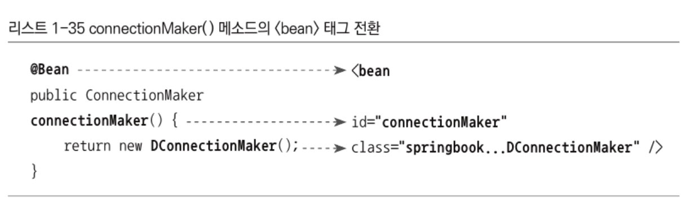

#### userDao() 전환

setter 메소드 선호하는 이유 중 하나는 XML로 의존관계 정보를 만들 때 굉장히 편리하다는 것!

- &lt;property> 태그를 사용하여 의존 오브젝트와의 관계 정의 가능.
  - name: 프로퍼티의 이름 → 이를 통해 수정자 메소드를 알 수 있음.
  - ref: 수정자 메소드를 통해 주입해줄 오브젝트의 빈 이름.

<br>

```java
userDao.setConnectionMaker(connectionMaker());
```

- `userDao.setConnectionMaker()` 는 userDao 빈의 connectionMaker 프로퍼티를 사용해 의존관계 정보를 주입해준다는 것!
  - 즉 name attribute엔 setConnectionMaker에서 프로퍼티의 이름을 가져와 `connectionMaker`이고
  - ref attribute에는 connectionMaker() 메소드를 호출한다는 의미로 메소드 이름인 `connectionMaker` 가 들어간다.

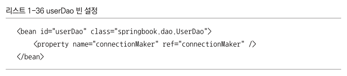

#### XML 의존관계 주입 정보

- name: DI에 사용할 수정자 메소드의 프로퍼티
- ref: 주입할 오브젝트를 정의한 빈의 ID

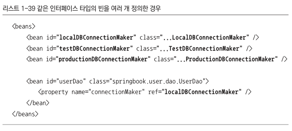

### 🌱 XML을 이용하는 애플리케이션 컨텍스트

> 참고로 스프링부트로 넘어오면서 XML을 사용한 설정은 잘 사용하진 않는다고 한다.

- XML 설정파일 이름: applicationContext.xml

```java
ApplicationContext context = new GenerixXmlApplicationContext("applicationContext.xml");
```

### 🌱 DataSource 인터페이스로 변환

#### DataSource 인터페이스 적용

```java
public interface DataSource extends CommonDataSource, Wrapper {
  Connection getConnection() throws SQLException;
}
```

### 🌱 프로퍼티 값의 주입

#### 값 주입

다른 빈의 오브젝트가 아닌 단순 값을 주입해주는 경우는 value attribute를 사용해준다.

다음과 같이 수정자 메소드를 호출해서 DB 연결을 넣는 경우 코드와 XML로 이렇게 표현할 수 있다.

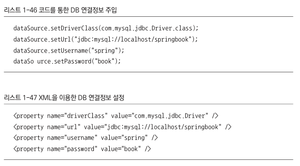

#### value 값의 자동 변환

또한 이 value에 지정한 텍스트 값은 적절한 자바 타입으로 변환된다. <br>
Integer, Double, String, Boolean 뿐 만 아니라 Class, URL, File 등의 오브젝트로도 변환이 가능하다.
