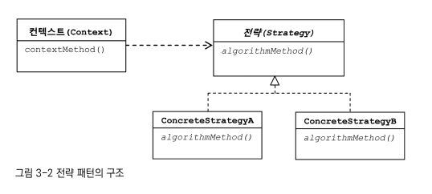
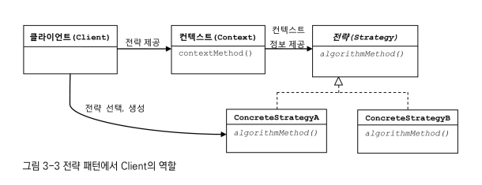
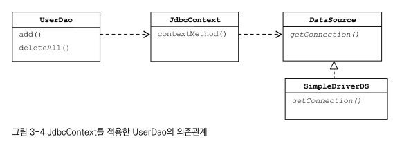
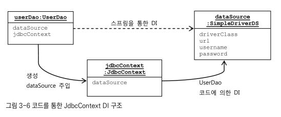
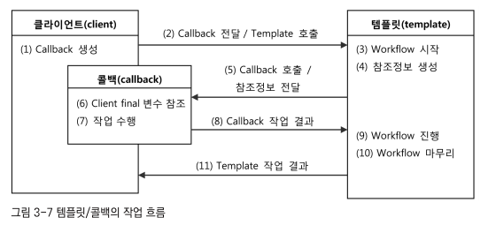
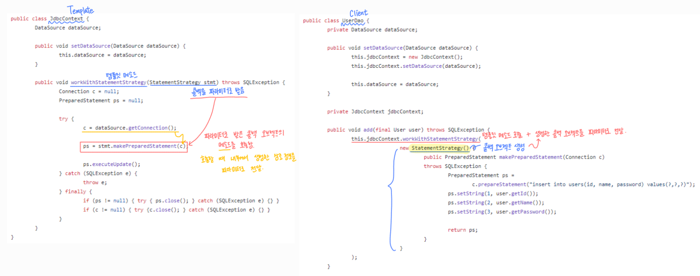
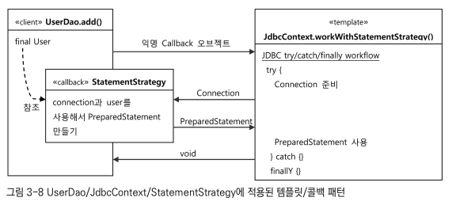

# 3장 템플릿

## 🌿 다시 보는 초난감 DAO

아직 심각한 문제점이 나와있음: 예외 처리!

### 🌱 예외처리 기능을 갖춘 DAO

DB 커넥션은 제한적인 리소스임. <br>
이런 제한적인 리소스를 공유해 사용한는 서버에서는 JDBC 코드에 반드시 지켜야 할 원칙이 있음.

= **예외 처리!**

> 시스템의 심각한 문제를 막기 위해, <br>
> 정상적인 JDBC 코드의 흐름을 따르지 않고 중간에 어떤 이유로든 <br>
> 예외가 발생했을 경우에도 사용한 리소스를 반환하도록 만들어야 함.

#### JDBV 수정 기능의 예외처리 코드

```java
public void deleteAll() throws SQLException {
    Connection c = dataSource.getConnection();

    /**
     * 여기서 예외가 발생하면 바로 메소드 실행이 중단된다.
     *
    **/
    PreparedStatement ps = c.preparedStatement("delete from users");
    ps.executeUpdate();

    ps.close();
    c.close();
}
```

- 만약 위 코드에서 PreparedSTATEMENT를 처리하는 중에 예외가 발생한다면, 이 때는 메소드 실행을 끝마치지 못하고 바로 메소드를 빠져나가게 된다.

이 때 문제는, `close();` 메소드가 실행되지 않아서 **제대로 리소스가 반환되지 않을 수 있다는 점**이다!

일반적으로 서버에서는 제한된 개수의 DB 커넥션을 생성하여 재사용 가능한 풀로 관리한다.

- 이때는 명시적으로 `close()` 를 통해 커넥션을 돌려줘야만 다음 커넥션 요청에서 재사용 할 수 있다.
- 그러므로 이런 식으로 오류가 날 때마다 미처 반환되지 못한 Connection이 계속 증가하면 **어느 순간 커넥션 풀의 여유가 사라지고 리소스가 모자르게 될 것!**

<br>

따라서 이러한 JDBC 코드에서는 어떤 상황에서도 가져온 리소스를 반환하는 **try/catch/finally 구문**을 사용해야 한다.

```java
public void deleteAll() throws SQLException {

    Connection c = null;
    PreparedStatement ps = null;

    try {
        c = dataSource.getConnection();
        ps = c.preparedStatement("delete from users");
        ps.executeUpdate();
    } catch (SQLException e) {
        throw e;
    } finally {
        if (ps != null) {
            try {
                ps.close(); // 커넥션 반환
            } catch (SQLException e) {
            }
        }
        if (ps != null) {
            try {
                c.close(); // 커넥션 반환
            } catch (SQLExeption e) {
            }
        }
    }
}
```

예외가 어느 시점에 나는가에 따라 Connection과 PreparedStatement 중 어떤 것의 `close()` 를 호출해야 할 지가 달라진다.

- 만약 아직 커넥션을 가져오지 못한 상태에서 `close()`를 시도하면, `NullPointerException`이 발생됨.
- 그러므로 finally{} 안에서 null 체크를 통해 `close()` 시도가 가능한 상태인지 확인하고, 커넥션을 반환해준다.

#### JDBC 조회 기능의 예외 처리

- 조회를 위한 JDBC 코드는 더 복잡해진다. Connection, PreparedStatement, ResultSet 까지 필요하기 때문!

```java
public int getCount() throws SQLException {

    Connection c = null;
    PreparedStatement ps = null;
    ResultSet rs = null;

    try {
        c = dataSource.getConnection();
        ps = c.preparedStatement("select * from users");

        rs = ps.executeQuery();
        rs.next();
        return rs.getInt(1);
    } catch (SQLException e) {
        throw e;
    } finally {

        /**
         * c -> ps -> rs 순서대로 커넥션을 생성했기 때문에,
         * 반대로 rs -> ps -> c 순서대로 커넥션을 반환한다.
        **/

        if (ps != null) {
            try {
                rs.close(); // 커넥션 반환
            } catch (SQLException e) {
            }
        }
        if (ps != null) {
            try {
                ps.close();
            } catch (SQLException e) {
            }
        }
        if (ps != null) {
            try {
                c.close();
            } catch (SQLExeption e) {
            }
        }
    }
}
```

- 여기서 finally{} 절 안에 있는 close()의 순서는 **만들어진 순서의 반대로 하는 것이 원칙**임.

## 🌿 변하는 것과 변하지 않는 것

### 🌱 JDBC try/catch/finally 코드의 문제점

- 너무 복잡한 try/catch/finally 블록이 2중으로 중첩되어 나옴.
- 모든 메소드마다 반복됨.

이렇게 반복되는 코드들은 COPY & PASTE 를 통해 반복해서 사용하면 매우 편하지만, <br>
실수를 했을 경우 치명적인 결과를 낳고, 실수를 찾아내기도 어렵다.

**변하지 않는, 그러나 많은 곳에서 중복되는 코드와 로직에 따라 자주 확장되고 자주 변하는 코드를 잘 분리해내야 한다!**

### 🌱 분리와 재사용을 위한 디자인 패턴 적용

```java
public void deleteAll() throws SQLException {

    Connection c = null;
    PreparedStatement ps = null;

    try {
        c = dataSource.getConnection();

        // 이 줄만 변하는 부분임!
        ps = c.preparedStatement("delete from users");

        ps.executeUpdate();
    } catch (SQLException e) {
        throw e;
    } finally {
        if (ps != null) {
            try {
                ps.close();
            } catch (SQLException e) {
            }
        }
        if (ps != null) {
            try {
                c.close();
            } catch (SQLExeption e) {
            }
        }
    }
}
```

우리가 작성한 `deleteAll()`의 코드를 보면 아래의 변하는 부분을 제외하면 전부 변하지 않는 부분임.

- `deleteAll()` 에서 변하는 부분

  ```java
    ps = c.preparedStatement("delete from users");
  ```

- `add()` 에서 변하는 부분

  ```java
    ps = c.preparedStatement("insert into users(id, name, password) values(?, ?, ?)");

    ps.setString(1, user.getId());
    ps.setString(2, user.getName());
    ps.setString(3, user.getPassword());
  ```

> 로직에 따라 변하는 부분을 변하지 않는 나머지 코드에서 분리해서 <br>
> 변하지 않는 부분을 재사용할 수 있는 방법이 있을까?

#### 메소드 추출

변하는 부분을 메소드로 추출한다.

```java
public void deleteAll() throws SQLException {

    Connection c = null;
    PreparedStatement ps = null;

    try {
        c = dataSource.getConnection();

        // 변하는 부분을 메소드로 추출한다.
        ps = makeStatement(c)

        ps.executeUpdate();
    } catch (SQLException e) {
        throw e;
    } finally {
      ...
    }
}

private PreparedStatement makeStatement(Connection c) throws SQLException {
    PreparedStatement ps;
    ps = c.preparedStatement("delete from users");
    return ps;
}
```

하지만 위 방법은 분리시키고 남은 메소드가 재사용이 필요한 부분이고, 분리된 메소드는 DAO 로직마다 새롭게 만들어서 학장돼야 하는 부분임.

재사용이 필요한 부분이 잘못 분리가 되었다.

#### 템플릿 메소드 패턴의 적용

**템플릿 메소드 패턴**? *상속*을 통해 기능을 확장해서 사용하는 부분임.

- 변하지 않는 부분: 슈퍼클래스에 위치시킴.
- 변하는 부분: 추상메소드로 정의하여 서브클래스에서 오버라이드하여 새롭게 정의해서 쓰도록 하는 것!

> UserDao를 추상 클래스로 변경하고, <br>
> 변하는 부분인 `makeStatment()` 메소드를 추상메소드로 정의한다.

```java
abstract protected PreparedStatement makeStatement(Connection c)
    throws SQLException;
```

<br>

이제 상속을 통해 클래스의 기능을 확장할 수 있으나, 여전히 제한은 남아있다.

1. 가장 큰 문제는 **DAO 로직마다 상속을 통해 새로운 클래스를 만들어야 한다는 점**이다.
2. 또 확장구조가 이미 클래스를 설계하는 시점에서 고정되어 버린다.
   - 변하지 않는 코드를 가진 UserDao의 JDBC `try/catch/finally` 블록과 변하는 PreparedStatement를 담고 있는 서브 클래스들이 이미 클래스 레벨에서 컴파일 시점에 그 관계까 결정되어 있다.

#### 전략 패턴의 적용

전략 패턴! <br>
: 오브젝트를 아예 둘로 분리하고 클래스 레벨에서는 인터페이스를 통해서만 의존하도록 만드는 전략 패턴.

- OCP(개방 폐쇄 원칙)를 잘 지키는 구조
- 템플릿 메소드 패턴보다 유연하고 확장성이 뛰어남.

<br>

OCP관점에서 봤을 때, 확장에 해당하는 변하는 부분을 **별도의 클래스로 만들어 추상화된 인터페이스를 통해 위임하는 방식**.



- 좌측의 Context의 `contextMethod()`에서 일정한 구조를 가지고 동작하다가,
- **특정 확장 기능**은 Strategy 인터페이스를 통해 외부의 독립된 전략 클래스에 위임함.

<br>

`deleteAll()` 에 적용하면?

- 변하지 않는 부분 = contextMethod()

<br>

`deleteAll()`의 컨텍스트

1. DB 커넥션 가져오기
2. PreparedStatement를 만들어줄 외부 기능 호출하기
3. 전달받은 PreparedStatement 실행하기
4. 예외가 발생하면 이를 다시 메소드 밖으로 던지기
5. 모든 경우에 만들어진 PreparedStatement와 Connection을 적절히 닫아주기

여기서 두번째 작업인 **PreapredStatement를 만들어주는 외부 기능이 전략 패턴에서 말하는 전략**!

전략 패턴에 따라 이 기능을 인터페이스로 만들고 PreparedStatement 생성 전략을 호출하면 됨.

- PreparedStatement를 만드는 전략의 인터페이스는 컨텍스트가 만들어둔 Connection을 전달 받아서 PreparedStatement를 만들고, 만들어진 PreparedStatement 오브젝트를 돌려줌.

```java
public interface StatementStrategy {
    PreparedStatement makePreparedStatement(Connection c)
        throws SQLException;
}
```

위 인터페이스를 구현한 PreparedStatement를 생성하는 클래스를 만들어준다.

```java
public class DeleteAllStatement implements StatementStrategy {
    public PreapredStatement makePreparedStatement(Connection c)
    throws SQLException {
        PreparedStatement ps = c.prepareStatement("delete from users");

        return ps;
    }
}
```

이 `DeleteAllStatement` 클래스를 deleteAll() 메소드에서 사용하면?

```java
public void deleteAll() throws SQLException {

    Connection c = null;
    PreparedStatement ps = null;

    try {
        c = dataSource.getConnection();

        StatementStrategy strategy = new DeleteAllStatement();
        ps = strategy.makePreparedStatement(c);

        ps.executeUpdate();
    } catch (SQLException e) {
        throw e;
    } finally {
      ...
    }
}
```

하지만 아직까지도 문제점은 남아있다.

전략 패턴은 필요에 따라 컨텍스트는 그대로 유지되면서 **전략을 바꿔쓸 수** 있어야 하는데, <br>
위 코드는 이미 구체적인 전략인 `DeleteAllStatement`를 사용하도록 고정되어 있다.

컨텍스트가 특정 구현 클래스인 `DeleteAllStatement`를 직접 알고 있다는 것이 전략 패턴에도 OCP에도 잘 들어맞는다고 볼 수 없다.

#### DI 적용을 위한 클라이언트/컨텍스트 분리

전략패턴의 실제적인 사용 방법을 살펴보자.

- Context가 어떤 전략을 사용하게 할 것인가는 앞단의 Client가 결정하는 게 일반적임.
- Client가 구체적인 전략의 하나를 선택하고 오브젝트로 만들어서 Context로 전달해주는 것.
- Context는 전달받은 그 Strategy 구현 클래스의 오브젝트를 사용함.



<br>

해당 패턴에서 가장 중요한 것은 <br>
이 컨텍스트에 해당하는 **JDBC try/catch/finally 코드를 클라이언트 코드인 StatementStrategy를 만드는 부분에서 독립시켜야 한다는 것!**

아래 코드는 클라이언트에 들어가야하는 코드임.

```java
StatementStrategy strategy = new DeleteAllStatement();
```

클라이언트가 위 코드처럼 구체적인 전략을 설정하고, `jdbcContextWithStatementStrategy()` 메소드 파라미터로 던져주는 것!

- 따라서 클라이언트에서는 try/catch/finally 부분이 보이지 않음.

```java
public void jdbcContextWithStatementStrategy(StatementStrategy stmt)
    throws SQLException {

    Connection c = null;
    PreparedStatement ps = null;

    try {
        c = dataSource.getConnection();

        ps = stmt.makePreparedStatement(c);

        ps.executeUpdate();
    } catch (SQLException e) {
        throw e;
    } finally {
        if (ps != null) {
            try { ps.close(); } catch (SQLException e) {}
        }
        if (ps != null) {
            try { c.close(); } catch (SQLExeption e) {}
        }
    }
}
```

- 클라이언트로부터 StatementStrategy 타입의 전략 오브젝트를 제공받음
- JDBC try/catch/finally 구조로 만들어진 컨텍스트 내에서 작업을 수행함.
- 제공받은 StatementStrategy 오브젝트는 `PreparedStatment` 생성이 필요한 시점에 호출해서 사용한다!

<br>

클라이언트에 해당하는 부분은 다음과 같다.

```java
public void deleteAll() throws SQLException {
    // 전략 오브젝트 생성
    StatementStrategy st = new DeleteAllStatement();

    // 컨텍스트 호출. 전략 오브젝트 전달
    jdbcContextWithStatementStrategy(st);
}
```

- 전략 오브젝트를 만들고 컨텍스트를 호출하는 책임을 지님.

### 🌱 전체 코드 정리 및 정리

<details>
<summary> 🖥️ 전체 코드를 정리합니다! </summary>
<div markdown="6">

<br>

- 전체 아키텍처


<br>

- 전략 인터페이스

```java
public interface StatementStrategy {
    PreparedStatement makePreparedStatement(Connection c)
        throws SQLException;
}
```

<br>

- 위의 전략 인터페이스를 구현한 클래스.
  - Delete 외에도 Read 등등의 전략을 StatementStrategy 인터페이스를 구현하여 생성할 수 있다.

```java
public class DeleteAllStatement implements StatementStrategy {
    public PreapredStatement makePreparedStatement(Connection c)
    throws SQLException {
        PreparedStatement ps = c.prepareStatement("delete from users");

        return ps;
    }
}
```

<br>

- 클라이언트 부분에서는 전략 오브젝트를 만들고 컨텍스트를 호출한다.
- 컨텍스트를 호출하는 `jdbcContextWithStatementStrategy` 메소드에서 전략에 맞는 실행과 try/catch/finally 예외 처리를 담당한다.

```java
public void deleteAll() throws SQLException {
    // 전략 오브젝트 생성
    StatementStrategy st = new DeleteAllStatement();

    // 컨텍스트 호출. 전략 오브젝트 전달
    jdbcContextWithStatementStrategy(st);
}

public void jdbcContextWithStatementStrategy(StatementStrategy stmt)
    throws SQLException {

    Connection c = null;
    PreparedStatement ps = null;

    try {
        c = dataSource.getConnection();

        // 전략에 맞는 실행!
        ps = stmt.makePreparedStatement(c);

        ps.executeUpdate();
    } catch (SQLException e) {
        throw e;
    } finally {
        if (ps != null) {
            try { ps.close(); } catch (SQLException e) {}
        }
        if (ps != null) {
            try { c.close(); } catch (SQLExeption e) {}
        }
    }
}
```

</div>
</details>

## 🌿 JDBC 전략 패턴의 최적화

deleteAll() 메소드에 담겨있던 변하는 부분과 변하지 않는 부분을 깔끔하게 분리해냄

독립된 작업 흐름이 담긴 jdbcContextithStatementStrategy()는 DAO 메소드들이 공유할 수 있게 됨.

DAO 메소드는 전략 패턴의 클라이언트로서 컨텍스트에 해당하는 jdbcContextWithStatmentStrategy() 메소드에 적절한 전략을 제공해주는 방법으로 사용할 수 있음.

여기서

- **컨텍스트 = PreparedStatement를 실행해주는 JDBC의 작업 흐름.**
- **전략 = PreparedStatement를 생성하는 것.**

### 🌱 전략 클래스의 추가 정보

이번엔 add() 메소드에도 적용해보자.

```java
public class AddStatement implements StatementStrategy {
    User user; // delete와 다르게 부가정보(user)가 필요함.

    // User는 생성자를 통해 주입받음.
    public AddStatement(User user) {
        this.user = user;
    }

    public PreparedStatement makePreparedStatement(Connection c)
        throws SQLException {

        PreparedStatement ps = c.prepareStatement(
            "insert into users(id, name, password) values(?,?,?)");

        ps.setString(1, user.getId());
        ps.setString(2, user.getName());
        ps.setString(3, user.getPassword());

        return ps;
    }
}
```

<br>

따라서 이를 사용하는 클라이언트의 add() 메소드는 다음과 같이 작성할 수 있다.

```java
public void add(User user) throws SQLException {
    StatementStrategy st = new AddStatement(user);
    jdbcContextWithStatementStrategy(st);
}
```

### 🌱 전략과 클라이언트의 동거

아직 개선해야 할 점

- 새로운 DAO 메소드마다 새로운 StatementStrategy 구현 클래스를 생성해야 한다는 점!
- DAO 메소드에서 StatementStrategy 에 전달할 User와 같은 부가정보가 있는 경우, 이를 위해 오브젝트를 전달받는 생성자와 이를 저장해둘 인스턴스 변수를 번거롭게 만들어야한다는 점.

#### 로컬 클래스

매번 StatementStrategy 전략 클래스를 독립된 파일로 만들지 말고 **UserDao 클래스 안의 내부 클래스**로 정의해버리자!

DeleteAllStatement나 AddStatement는 UserDao 밖에서는 사용되지 않음.

- UserDao의 메소드 로직에 강하게 결합되어있음.

```java
public void add(User user) throws SQLException {
    // add() 내부에 로컬 클래스로 AddStatement를 정의한다.
    class AddStatement implements StatementStrategy {
        User user;

        public AddStatement(User user) {
            this.user = user;
        }

        public PreparedStatement makePreparedStatement(Connection c)
            throws SQLException {

            PreparedStatement ps = c.prepareStatement(
                "insert into users(id, name, password) values(?,?,?)");

            ps.setString(1, user.getId());
            ps.setString(2, user.getName());
            ps.setString(3, user.getPassword());

            return ps;
        }
    }

    StatementStrategy st = new AddStatement(user);
    jdbcContextWithStatementStrategy(st);
}
```

- 이렇게 정의된 로컬 클래스는 선언된 메소드 내에서만 사용이 가능하다.
  - 어차피 AddStatement class 가 사용될 곳이 add() 메소드 뿐이기에 이렇게 사용하기 전에 바로 정의해서 써준다!
- 클래스 파일도 줄고 코드 이해도 쉬워진다.

<br>

- 또한 내부 클래스는 메소드 내부에 정의되기 때문에 메소드 내부 변수들에 접근이 가능하다.
  - 메소드의 로컬 변수에 직접 접근이 가능하므로, <Br>
    여기서는 부가정보였던 User를 따로 생성자를 통해 주입을 받는 것이 아닌, **직접 접근해서 사용**할 수 있다.

```java
public void add(final User user) throws SQLException {
    class AddStatement implements StatementStrategy {
        public PreparedStatement makePreparedStatement(Connection c)
            throws SQLException {

            PreparedStatement ps = c.prepareStatement(
                "insert into users(id, name, password) values(?,?,?)");

            // 내부 클래스에서 외부 메소드의 로컬 변수에 접근 가능함.
            // 여기서는 user 변수에 접근하였음.
            ps.setString(1, user.getId());
            ps.setString(2, user.getName());
            ps.setString(3, user.getPassword());

            return ps;
        }
    }

    // 생성자 파라미터로 전달할 필요가 사라짐.
    StatementStrategy st = new AddStatement();
    jdbcContextWithStatementStrategy(st);
}
```

#### 익명 내부 클래스

여기서 더 업그레이드 한다면?

AddStatement 클래스는 add() 메소드에서만 사용할 용도로 만들어짐.

- 따라서 더 간결하게 클래스 이름도 제거할 수 있는 것!
- **익명 내부 클래스**를 사용해보자.

```java
public void add(final User user) throws SQLException {

    // 구현하는 인터페이스를 생성자처럼 이용한다.
    jdbcContextWithStatementStrategy(
        new StatementStrategy() {
            public PreparedStatement makePreparedStatement(Connection c)
                throws SQLException {

                PreparedStatement ps = c.prepareStatement(
                    "insert into users(id, name, password) values(?,?,?)");

                ps.setString(1, user.getId());
                ps.setString(2, user.getName());
                ps.setString(3, user.getPassword());

                return ps;
            }
    });
}
```

- deleteAll() 메소드도 다음과 같이 변경할 수 있다.

```java
public void deleteAll() throws SQLException {

    // 구현하는 인터페이스를 생성자처럼 이용한다.
    jdbcContextWithStatementStrategy(
        new StatementStrategy() {
            public PreparedStatement makePreparedStatement(Connection c)
                throws SQLException {

                return c.prepareStatement("delete from users");
            }
    });
}
```

## 🌿 컨텍스트와 DI

### 🌱 JdbcContext의 분리

- UserDao의 메소드 = 클라이언트
- 익명 내부 클래스 = 개별 전략
- `jdbcContextWithStatementStrategy()` 메소드 = 컨텍스트
  - 컨텍스트 메소드는 UserDao 내의 PreparedStatement를 실행하는 기능을 가진 메소드에서 공유 가능.

`jdbcContextWithStatementStrategy()`는 UserDao외에도 다른 DAO에서도 사용가능해야 한다!

위 메소드를 UserDao 클래스 밖으로 독립시켜서 모든 DAO에서 사용 가능하게 설정해보자.

#### 클래스의 분리

- 분리해서 만들 클래스 = `JdbcContext`

```java
public class JdbcContext {
    private DataSource dataSource;

    // DataSource 타입 빈을 DI 받을 수 있게 준비해둠.
    public void setDataSource(DataSource datasource) {
        this.dataSource = dataSource;
    }

    public void workWithStatementStrategy(StatementStrategy stmt) throws SQLException {
        Connection c = null;
        PreparedStatement ps = null;

        try {
            c = this.dataSource.getConnection();

            ps = stmt.makePreparedStatement(c);
            ps.executeUpdate();
        } catch (SQLException e) {
            throw e;
        } finally {
            if (ps != null) { try { ps.close(); } catch (SQLException e){} }
            if (c != null) { try { c.close(); } catch (SQLException e){} }
        }
    }
}

```

```java
public class UserDao {
    ...
    private JdbcContext jdbcContext;

    // JdbcContext를 DI 받도록 만듦.
    public void setJdbcContext(JdbcContext jdbcContext) {
        this.jdbcContext = jdbcContext;
    }

    public void add(final User user) throws SQLException {
        this.jdbcContext.workWithStatementStrategy(
            new StatementStrategy() {...}
        );
    }

    public void deleteAll(final User user) throws SQLException {
        this.jdbcContext.workWithStatementStrategy(
            new StatementStrategy() {...}
        );
    }
}
```

#### 빈 의존관계 변경

UserDao는 이제 JdbcContext에 의존하고 있음.

- 근데 JdbcContext는 인터페이스인 DataSource와 다르게 구체 클래스!

스프링 DI 는 기본적으로 **인터페이스를 사이에 두고 의존 클래스를 바꿔서 사용하도록 하는 게 목적**!

하지만 이 경우 JdbcContext는 그 자체로 독립적인 JDBC 컨텍스트를 제공해주는 서비스 오브젝트로서 의미가 있을 뿐이고 구현 방법이 바뀔 가능성은 희박함. <br>
→ 따라서 인터페이스를 구현하도록 만들지 않음.



### 🌱 JdbcContext의 특별한 DI

#### 스프링 빈으로 DI

UserDao는 인터페이스를 거치지 않고 코드에서 바로 JdbcContext라는 구체 클래스를 사용하고 있다.

- 이렇게 인터페이스를 사용하지 않고 DI를 적용하는 것은 문제가 있진 않을까?

물론 의존관계 주입이라는 개념을 충실히 따르자면, 인터페이스를 사이에 둬서 클래스 레벨에서는 의존관계까 고정되지 않게 하고 런타임 시에 의존할 오브젝트와의 관계를 다이내믹하게 주입해주는게 맞음!

하지만 스프링의 DI를 **넓게 보면** 객체의 생성, 관계 설정에 대한 제어 권한을 외부로 위임했다는 **IoC의 개념을 포괄**함.

- 그런 의미에서 JdbcContext역시도 DI의 기본은 따르고 있다는 것!

<br>

그렇다면 JdbcContext를 UserDao와 **왜 굳이 DI 구조로** 만들어야 했을까?

1. JdbcContext가 스프링 컨테이너의 싱글톤 레지스트리에서 관리되는 싱글톤 빈이 되기 때문!
   - JdbcContext는 stateless함! (dataSource는 읽기 전용이므로 문제 X) : 싱글톤이 되는 데 아무런 문제가 없음.
   - JDBC 컨텍스트 메소드를 제공해주는 일종의 서비스 오브젝트임. <br>
     → 그러므로 **여러 오브젝트에서 공유해 사용하는 것**이 이상적!
2. JdbcContext가 DI를 통해 다른 빈에 의존하고 있기 때문.
   - JdbcContext는 dataSource property를 통해 DataSource 오브젝트를 주입받도록 되어있음.
   - DI를 위해서는 주입되거나, 주입받는 오브젝트 모두 스프링 빈으로 등록되어 있어야 함!
   - JdbcContext는 다른 빈을 DI 받기 위해서라도 스프링 빈으로 등록돼야 함.

<br>

실제로 스프링에서는 클래스를 직접 의존하는 DI가 등장하는 경우도 있음.

중요한 것은 인터페이스의 사용 여부! <br>
→ 왜 인터페이스를 사용하지 않았을까?

인터페이스가 없다는 것 = UserDao가 JdbcContext가 매우 긴밀한 관계를 맺었다는 것.

- 만약 JDBC가 아닌 JPA나 하이버네이트 같은 ORM을 사용해야 한다면? <br>
  → **JdbcContext도 통째로 바뀌어야 함.**
- JdbcContext는 테스트에서도 다른 구현으로 대체해서 사용할 이유가 없음.

위 경우에는 굳이 인터페이스를 두지 말고 강력한 결합을 가진 관계를 허용해도 됨.

#### 코드를 이용하는 수동 DI

JdbcContext를 UserDao에 DI 하는 대신 UserDao 내부에서 직접 DI를 적용하는 방법도 존재한다.

- 대신 JdbcContext를 싱글톤으로 만들려는 것은 포기해야 한다.
  - DAO 하나마다 하나씩의 JdbcContext 오브젝트를 가지고 있겠다는 것!

DAO 개수만큼 JdbcContext 오브젝트가 필요하겠지만, 그정도는 메모리에 주는 부담이 거의 없음.

- 또한 자주 만들어졌다가 제거되는 것도 아니기에 GC(garbage collector)에 대한 부담도 없음.

<br>

JdbcContext를 빈으로 등록하지 않았기에, JdbcContext의 생성과 초기화의 제어권은 UserDao가 가진다.

남은 문제는 JdbcContext가 다른 빈(DataSource)을 인터페이스를 통해 간접적으로 의존하고 있다는 점이다.

- 이 경우에는 UserDao에 JdbcContext의 DataSoucre DI까지 맡겨서 해결한다.
- UserDao가 임시로 DI 컨테이너처럼 동작하게 만드는 것!

<br>

→ JdbcContext에 주입해줄 의존 오브젝트인 DataSource는 UserDao가 대신 DI 받도록 하면 됨.

- UserDao는 직접 DataSource 빈을 필요로 하지 않지만, JdbcContext에 주입해주기 위한 용도로 제공받는 것!



<br>

1. 스프링 설정파일에 userDao와 dataSource 두 개만 빈으로 정의한다.
2. userDao 빈에 DataSource 타입 프로퍼티를 지정하여 dataSource 빈을 주입받는다.
3. UserDao는 JdbcContext 오브젝트를 만들면서 DI 받은 DataSource 오브젝트를 JdbcContext의 수정자 메소드로 주입해준다.
4. 만들어진 JdbcContext의 오브젝트는 UserDao의 인스턴스 변수에 저장해두고 사용한다.

```java
public class UserDao {
    ...
    private JdbcContext jdbcContext;

    /**
     * 수정자 메소드이면서 JdbcContext에 대한 생성, DI 작업을 도잇에 수행함.
    **/
    public void setDataSource(DataSource dataSource) {
        // IoC: JdbcContext 생성
        this.jdbcContext = new JdbcContext();

        // 의존 오브젝트 주입
        this.jdbcContext.setDataSource(dataSource);
        this.dataSource = dataSource;
    }
}
```

여기서 `setDataSource()` 메소드는 DI 컨테이너가 DataSource 오브젝트를 주입해줄 때 호출됨.

- 이때 JdbcContext에 대한 수동 DI 작업을 진행하면 된다!

먼저 JdbcContext의 오브젝트를 만들어서 인스턴스 변수에 저장해두고, JdbcContext에 UserDao가 DI받은 DataSource 오브젝트를 주입해주면 완벽한 DI 작업이 완료된다.

<br>

이 방법의 **장점**?

굳이 인터페이스를 두지 않아도 될 만큼 긴밀한 관계를 갖는 클래스들(UserDao와 JdbcContext)을 어색하게 따로 빈으로 만들지 않고 내부에서 직접 만들어 사용하면서도 다른 오브젝트에 대한 DI를 적용할 수 있다는 것!!

## 🌿 템플릿과 콜백

**복잡하지만 바뀌지 않는 일정한 패턴을 갖는 작업 흐름이 존재하고 그중 일부분만 바꿔서 사용해야 하는 경우**에 위와 같이 전략 패턴을 사용한다.

- 추가적으로 전략 패턴의 기본 구조에 익명 내부 클래스까지 활용하였음.

이런 방식을 스프링에서는 **템플릿/콜백 패턴**이라고 부른다.

- 전략 패턴의 컨텍스트 = **템플릿**
  - 어떤 목적을 위해 미리 만들어둔 모양이 있는 틀.
  - 템플릿 메소드 패턴은 고정된 틀의 로직을 가진 패턴을 템플릿 메소드를 슈퍼 클래스에 두고, 바뀌는 부분을 서브클래스의 메소드에 두는 구조로 이루어진다.
- 익명 내부 클래스로 만들어지는 오브젝트 = **콜백**
  - 콜백? 실행되는 것을 목적으로 다른 오브젝트의 메소드에 전달되는 오브젝트.

### 🌱 템플릿/콜백의 동작원리

- 템플릿: 고정된 작업 흐름을 가진 크드를 재사용한다!
- 콜백: 템플릿 안에서 호출되는 것을 목적으로 만들어진 오브젝트

#### 템플릿/콜백의 특징

전략 패턴과 달리 콜백은 보통 단일 메소드 인터페이스를 사용함.

- 템플릿의 작업 흐름 중 특정 기능을 위해 한 번 호출되는 경우가 일반적이기 때문.

콜백은 일반적으로 하나의 메소드를 가진 인터페이스를 구현한 익명 내부 클래스로 만들어진다!

<Br>

콜백 인터페이스 메소드에는 보통 파라미터가 존재함.

- 위의 JdbcContext 에서는 템플릿인 workWithStatementStrategy() 메소드 내에서 생성한 Connection 오브젝트를 콜백의 메소드인 makePreparedStatement()를 실행할 때 파라미터로 넘겨줌.

```java
public class JdbcContext {
	DataSource dataSource;

	public void setDataSource(DataSource dataSource) {
		this.dataSource = dataSource;
	}

	public void workWithStatementStrategy(StatementStrategy stmt) throws SQLException {
		Connection c = null;
		PreparedStatement ps = null;

		try {
            // 여기서 JdbcContext가 Connection 오브젝트를 생성함.
			c = dataSource.getConnection();

            // 파라미터 - 콜백(Statement Strategy 오브젝트)의 메소드를 실행할 때 Connection 오브젝트를 전달함.
			ps = stmt.makePreparedStatement(c);

			ps.executeUpdate();
		} catch (SQLException e) {
			throw e;
		} finally {
			if (ps != null) { try { ps.close(); } catch (SQLException e) {} }
			if (c != null) { try {c.close(); } catch (SQLException e) {} }
		}
	}
}
```

```java
public class UserDao {
	private DataSource dataSource;

	public void setDataSource(DataSource dataSource) {
		this.jdbcContext = new JdbcContext();
		this.jdbcContext.setDataSource(dataSource);

		this.dataSource = dataSource;
	}

	private JdbcContext jdbcContext;

	public void add(final User user) throws SQLException {
		this.jdbcContext.workWithStatementStrategy(
                // 여기서는 StatementStrategy = 콜백!
                // 하나의 메소드(makePreparedStatement())를 가진 인터페이스(StatementStrategy)를 구현한 익명 내부 클래스
				new StatementStrategy() {
					public PreparedStatement makePreparedStatement(Connection c)
                      throws SQLException {
						PreparedStatement ps =
							c.prepareStatement("insert into users(id, name, password) values(?,?,?)");
						ps.setString(1, user.getId());
						ps.setString(2, user.getName());
						ps.setString(3, user.getPassword());

						return ps;
					}
				}
		);
	}

    ...
```

<br>



- 클라이언트: 템플릿 안에서 실행될 로직을 담은 콜백 오브젝트를 만들고, 콜백이 참조할 정보를 제공함. <br>
  만들어진 콜백은 클라이언트가 템플릿의 메소드를 호출할 때 파라미터로 전달됨.
  - 위 코드에서는 클라이언트가 UserDao! <br>
    실행될 로직을 담은 콜백 오브젝트인 StatementStrategy 오브젝트를 생성(구현)함.
  - 템플릿(JdbcContext)의 메소드(`workWithStatementStrategy()`)를 호출할 때 이 콜백이 파라미터로 전달됨.
- 템플릿은 정해진 작업 흐름을 따라 작업을 진행하다가 내부에서 생성한 참조정보를 가지고 콜백 오브젝트의 메소드를 호출함.<br>
  콜백은 클라이언트 메소드에 있는 정보와 템플릿이 제공한 참조정보를 이용하여 작업을 수행하고 그 결과를 다시 템플릿에 돌려줌.

  - 위 코드에서는 템플릿이 JdbcContext임. <br>
    workWithStatementStrategy() 에 정의된 순서대로 작업을 진행하다가, <br>
    내부에서 생성한 참조정보(dataSource Connection)을 통해 콜백의 메소드(`makePreparedStatement()`)를 호출함.
  - 콜백(StatementStrategy)은 이를 통해 makePreparedStatement() 작업을 수행하고 그 결과를 템플릿에 돌려줌. (아래 코드 참고)
    ```java
    ps = stmt.makePreparedStatement(c);
    ```

- 템플릿은 콜백이 돌려준 정보를 사용하여 작업을 마저 수행함. 경우에 따라 최종 결과를 클라이언트에 다시 돌려주기도 함.

<br>

> **너무 헷갈려서 정리한 이미지** 

- DI 방식의 전략 패턴 구조라고 생각해보면 간단함!

클라이언트가 템플릿 메소드를 호출하면서 콜백 오브젝트를 전달하는 것은 메소드 레벨에서 일어나는 DI.

템플릿이 사용할 콜백 인터페이스를 구현한 오브젝트를 메소드를 통해 주입해주는 DI 작업이 클라이언트가 템플릿의 기능을 호출하는 것과 동시에 일어남.

- 템플릿의 workWithStatementStrategy() 메소드에 구현한 StatementStrategy 오브젝트를 바로 넣어줌.

<br>

> 일반적인 DI는 템플릿에 인스턴스 변수를 만들어 의존 오브젝트를 수정자로 받는 방식을 사용함.

템플릿/콜백 방식에서는 매번 **메소드 단위로 사용할 오브젝트를 새롭게 전달** 받음.

- 콜백 오브젝트가 내부 클래스로서 자신을 생성한 클라이언트 메소드 내의 정보를 직접 참조하는 것 역시도 템플릿/콜백 방식의 고유한 특징
  - 위 코드에서는 클라이언트 메소드 `add()`의 로컬 변수인 User 정보를 직접 참조하였음.
- 클라이언트와 콜백이 강하게 결합하는 것!

<br>

클라이언트 콜백 방식 <br>
= "전략 패턴의 장점 + DI의 장점 + 익명 내부 클래스 사용 전략"의 결합

#### JdbcContext에 적용된 템플릿/콜백

- 템플릿과 클라이언트가 메소드 단위인 것이 특징임.

> 위에 정리해놓은 필기 이미지와 함께 보도록 하자!



### 🌱 편리한 콜백의 재활용

아직까지 한 가지 아쉬운 점이 있다.

- DAO 메소드에서 매번 익명 내부 클래스를 사용하기 때문에 상대적으로 코드를 작성하고 읽기가 조금 불편하다는 점이다!

#### 콜백의 분리와 재활용

복잡한 익명 내부 클래스의 사용을 최소화할 수 있는 방법을 찾아보자.

콜백 오브젝트 구조를 다시 살펴보면

- 콜백 클래스 정의와 오브젝트 생성 부분은 변하지 않고,
- SQL 문장만 변하는 것을 확인할 수 있다.

```java
public void deleteAll() throws SQLException {
    this.jdbcContext.workWithStatementStrategy(
        new StatementStrategy() {
            public PreparedStatement makePreparedStatement(Connection c)
                    throws SQLException {
                // "delete from users" 라는 문자열만 바뀐다!
                return c.prepareStatement("delete from users");
            }
        }
    );
}
```

<br>
따라서 중복되는 부분은 따로 분리해보자.

단순 SQL을 필요로하는 콜백이라면 바뀌는 SQL 문자열을 제외하고 나머지는 매번 동일할 것이다.

- 바뀌지 않는 모든 부분을 executeSQL() 메소드로 만들어냄.

```java
public void deleteAll() throws SQLException {
    executeSQL("delete from users"); // 변하는 SQL 문장을 파라미터로 전달.
}

public void executeSQL(final String query) throws SQLException {
    this.jdbcContext.workWithStatementStrategy(
        new StatementStrategy() {
            public PreparedStatement makePreparedStatement(Connection c)
                    throws SQLException {
                // 바뀌는 문자열을 query 파라미터로 받는다!
                return c.prepareStatement(query);
            }
        }
    );
}

```

#### 콜백과 템플릿의 결합

한 단계 더 나아가보자. executeSQL() 메소드는 UserDao만 사용하기에는 아깝다.

이렇게 재사용 가능한 콜백을 담고 있는 메소드는 DAO가 공유하는 템플릿 클래스로 옮기는 게 더 합리적이다!

엄밀히 말하면 "템플릿"은 JdbcContext가 아닌, `workWithStatementStrategy()` 메소드이기에, **JdbcContext 클래스로 콜백 생성 및 템플릿 호출이 담긴 executeSQL() 메소드를 옮긴다고 해도 문제될 것은 없다!**

```java
public class JdbcContext {
    ...

    public void executeSQL(final String query) throws SQLException {
        workWithStatementStrategy(
            new StatementStrategy() {
                public PreparedStatement makePreparedStatement(Connection c)
                        throws SQLException {
                    return c.prepareStatement(query);
                }
            }
        );
    }
}

// UserDao 클래스도 다음과 같이 변경해준다.
public class UserDao {
    private Jdbc Template jdbcTemplate;

    public void deleteAll() throws SQLException {
		this.jdbcTemplate.update("delete from users");
	}

    ...
}

```

따라서 이렇게 코드를 변경하면 JdbcContext 안에 클라이언트와 템플릿, 콜백이 모두 공존하며 동작하는 구조가 된다.

- `add()` 에도 같은 방법을 적용할 수 있다.
  - 여기서의 콜백은 SQL 문장과 함께 PreparedStatement에 바인딩될 파라미터 내용이 추가되어야 한다.
  - 여기서 파라미터 개수가 일정하지 않기 때문에 자바 5 가변인자로 정의해두면 편리하게 사용 가능하다.

### 🌱 템플릿/콜백의 응용

템플릿/콜백 패턴은 사실 스프링이 제공해주는 독점적인 기술이 아님

- 하지만 스프링에서 이 패턴을 적극적으로 활용하고 있는 것!

DI도 순수한 스프링의 기술은 아니지만, 스프링에서 이를 편리하게 사용할 수 있도록 도와주는 컨테이너를 제공하고, 사용 방법을 지지해주는 것.

따라서 스프링이 제공하는 템플릿/콜백 기능을 명확히 알고 직접 만들어서 사용할 줄도 알아야 함.

<br>

고정된 작업 흐름을 갖고 있으면서 여기저기서 자주 반복되는 코드가 있다면 중복되는 코드를 분리할 방법을 생각해보는 습관을 기르자.

1. 중복된 코드는 메소드로 분리해보고,
2. 일부 작업을 바꾸어 사용해야 한다면 인터페이스를 사이에 두고 분리하여 전략 패턴을 적용하고 DI로 의존관계를 관리하도록 만든다.
3. 만약 바뀌는 부분이 한 애플리케이션 안에서 동시에 여러 종류가 만들어질 수 있다면 템플릿/콜백 패턴 적용을 고려한다.

#### 테스트와 try/catch/finally

만약 계산기 클래스를 만들 때, 파일을 읽어서 처리하는 비슷한 기능이 새로 필요하다고 가정해보자.

먼저 템플릿/콜백 패턴을 적용해보자.

1. 템플릿에 담을 반복되는 작업 흐름은 어떤 것인가?
2. 템플릿이 콜백에게 전달해줄 내부의 정보는 무엇인가?
3. 콜백이 템플릿에게 돌려줄 내용은 무엇인가?
4. 템플릿이 작업을 마친 뒤 클라이언트에게 돌려줄 내용은 무엇인가?

> 템플릿/콜백을 정할 때는 템플릿과 콜백의 경계를 정하고, <br>
> 템플릿이 콜백에게, 콜백이 템플릿에게 각각 전달되는 내용이 무엇인지 파악하는 것이 굉장히 중요하다.

<Br>

먼저 가장 쉽게 생각할 수 있는 구조는?

- BufferedReader를 만들어 콜백에게 전달 <br>
  -> 콜백이 각 라인을 읽어서 처리 후 결과를 템플릿에게 돌려주는 것!

```java
public interface BufferedReaderCallBack {
    Integer doSomethingWithReader(BufferedReader br) throws IOException;
}
```

이제 템플릿 부분을 메소드로 분리하자.

```java
public Integer fileReadTemplate(String filepath, BufferedReaderCallBack callback)
  throws IOException {
    BufferedReader br = null;
    try {
        br = new BufferedReader(new FileReader(filepath));
        int ret = callback.doSomethingWithReader(br);
        return ret;
    } catch (IOException e) {
        System.out.println(e.getMessage());
        throw e;
    } finally {
        if (br != null) {
            try { br.close(); }
            catch (IOException e) {
                System.out.println(e.getMessage());
            }
        }
    }
  }
```

- BufferedReader를 만들어 넘겨주는 것, 등등 번거로운 작업을 템플릿에서 처리함.
- 준비된 BufferedReader를 통해 작업 수행은 콜백을 호출해서 처리하도록 만듦.

이렇게 준비된 템플릿 메소드를 사용하도록 계산기 메소드를 수정해본다면?

```java
public Integer calcSum(String filepath) throws IOException {
    BufferedReaderCallBack sumCallback =
        new BufferedReaderCallBack() {
            public Integer doSomethingWithReader(br) throws IOException {
                Integer sum = 0;
                String line = null;
                while ((line = br.readLine()) != null) {
                    sum += Integer.valueOf(line);
                }
                return sum;
            }
        };
    return fileReadTemplate(filepath, sumCallback);
}
```

#### 템플릿/콜백의 재설계

아직까지도 계산기 클래스의 메소드들이 많은 부분에서 중복된다.

- calcSum() 메소드

```java
Integer sum = 0;
String line = null;
while((line = br.readLine()) != null) {
    sum += Integer.valueOf(line); // 이 라인만 바뀜
}
return sum
```

<br>

- calcMultiply() 메소드

```java
Integer multifly = 1;
String line = null;
while((line = br.readLine()) != null) {
    multifly *= Integer.valueOf(line); // 이 라인만 제외하고 전부 중복코드
}
return sum
```

<br>

템플릿과 콜백을 찾아낼 때는 변하는 코드의 경계를 찾고 그 경계를 사이에 두고 주고받는 일정한 정보가 있는지 확인하면 된다.

위 두 메소드에서 바뀌는 코드는 실제로 네번째 줄뿐임.

앞에서 **네 번째 라인으로 전달되는 정보는 처음에 선언한 변수 값인 multifly 또는 sum**임.

그 네 번째 라인을 처리하고 다시 외부로 전달되는 것? <br>
multifly or sum과 각 라인의 숫자 값을 가지고 계산한 결과다!

```java
public interface LineCallback {
    Integer doSomethingWithLine(String line, Integer value);
}
```

이렇게 새로 만든 LineCallback 인터페이스를 경계로 만든 새로운 계산 결과를 리턴 값을 통해 다시 전달받는다.

```java
public Integer lineReadTemplate(String filepath, LineCallback callback, int initVal) throws IOException {
    BufferedReader br = null;

    try {
        br = new BufferedReader(new FileReader(filepath));
        Integer res = initVal;
        String line = null;
        while((line = br.readLine()) != null) {
            res = callback.doSomethingWithLine(line, res);
        }
        return res;
    } catch (IOException e) {
        ...
    } finally {
        ...
    }
}
```

<br>

- 위의 lineReadTemplate()을 사용하도록 calcSum(), calcMultiply() 메소드를 고쳐준다.

```java
public Integer calcSum(String filepath) throws IOException {
    LineCallback sumCallback =
        new LineCallBack() {
            public Integer doSomethingWithLine(String line, Integer value) {
                return value + Integer.valueOf(line);
            }
        };
    return lineReadTemplate(filepath, sumCallback, 0);
}

public Integer calcMultiply(String filepath) throws IOException {
    LineCallback multiplyCallback =
        new LineCallBack() {
            public Integer doSomethingWithLine(String line, Integer value) {
                return value * Integer.valueOf(line);
            }
        };
    return lineReadTemplate(filepath, sumCallback, 0);
}
```

#### 제네릭스를 이용한 콜백 인터페이스

만약 파일을 라인 단위로 처리해서 만드는 결과의 타입을 다양하게 가져가고 싶다면, 자바 언어의 Generics 제네릭스를 이용하면 된다.

파일의 각 라인에 있는 문자를 모두 연결해서 하나의 스트링으로 돌려주는 기능을 만든다고 생각해보자.

- 결과 값이 String 이어야 하므로, 정수값 뿐 만 아닌 문자열도 처리할 수 있도록 확장해보자.

```java
public interface LineCallback<T> {
    T doSomethingWithLine(String line, T value);
}
```

<br>

- 템플릿인 lineReadTemplate() 메소드 역시도 타입 파라미터를 사용해 제네릭 메소드로 만들어준다.
- 콜백의 타입 파라미터와 초기값인 initVal의 타입, 템플릿의 결과 값 타입을 모두 동일하게 선언해야 한다.

```java
public <T> T lineReadTemplate(String filepath, LineCallback<T> callback, T initVal) throws IOException {
    BufferedReader br = null;

    try {
        br = new BufferedReader(new FileReader(filepath));
        T res = initVal;
        String line = null;
        while((line = br.readLine()) != null) {
            res = callback.doSomethingWithLine(line, res);
        }
        return res;
    } catch (IOException e) {
        ...
    } finally {
        ...
    }
}
```

따라서 Integer에 타입이 한정된 메소드가 아닌 다양한 타입을 받을 수 있게 되었다.

이제 파일의 모든 내용을 하나의 문자열로 길게 연결하는 기능을 가진 메소드를 추가해보면?

- T type을 String으로 지정하여 익명 클래스를 구현해줌.

```java
public String concatenate(String filepath) throws IOException {
    LineCallback<String> concatenameCallback =
        new LineCallback<String>() {
            public String doSomethingWithLine(String line, String value) {
                return value + line;
            }
        };

    return lineReadTemplate(filepath, concatenateCallback, "");
}
```

<br>

이렇게 범용적으로 만들어진 템플릿/콜백을 이용하면 파일을 라인 단위로 처리하는 다양한 기능을 편리하게 만들 수 있다.

새롭게 살펴본

1. **리턴 값을 갖는 템플릿**이나
2. **템플릿 내에서 여러 번 호출되는 콜백 오브젝트**,
3. **제네릭스 타입을 갖는 메소드나 콜백 인터페이스 등의 기법**은

스프링의 템플릿/콜백 패턴이 적용된 곳에서 종종 사용되고 있음.

## 🌿 스프링의 JDBC TEMPLATE

스프링이 제공하는 템플릿/콜백 기술을 살펴보자.

스프링은 JDBC를 이용하는 DAO에서 사용할 수 있도록 준비된 다양한 템플릿과 콜백을 제공한다.

- 스프링이 제공하는 JDBC 코드용 기본 템플릿 = JdbcTemplate

다음과 같이 UserDao의 코드를 수정하자.

```java
public class UserDao {
    ...
    private JdbcTemplate jdbcTemplate;

    public void setDataSource(DataSource dataSource) {
        this.jdbcTemplate = new JdbcTemplate(dataSource);

        this.dataSource = dataSource;
    }
}
```

### 🌱 update()

deleteAll() 에 먼저 적용해보자.

기존의 `deleteAll()`은 StatementStrategy 인터페이스의 `makePreparedStatment()` 메소드를 콜백으로 적용함.

- 이에 대응하는 JdbcTemplate의 콜백은 PreparedStatementCreator 인터페이스의 `createPreparedStatment()` 메소드임.

```java
public void deleteAll() {
    this.jdbcTemplate.update(
        new PreparedStatementCreator() {
            public PreparedStatement createPreparedStatement(Connection con) throws SQLException {
                return con.prepareStatement("delete from users");
            }
        }
    )
}
```

<br>

앞에서 만들었던 `execureSql()`?

- SQL 문장만 전달하면 미리 준비된 콜백을 만들어서 템플릿을 호출하는 것까지 한 번에 해주는 편리한 메소드.
- JdbcTemplate 에서도 기능이 비슷한 메소드가 존재함.

<br>

내장 콜백을 사용하는 메소드를 호출하도록 수정함.

```java
public void deleteAll() {
    this.jdbcTemplate.update("delete from users");
}
```

<br>

JdbcTemplate은 앞에서 구상만 해보고 만들지는 못했던 add() 메소드에 대한 편리한 메소드도 제공함.

치환자를 가진 SQL로 PreparedStatement를 만들고 함께 제공하는 파라미터를 순서대로 바인딩해주는 기능을 가진 update() 메소드를 사용할 수 있다.

- SQL과 함께 가변인자로 선언된 파라미터를 제공해주면 된다.

```java
PreparedStatement ps =
    c.prepareStatement("insert into users(id, name, password) values (?,?,?)");

ps.setString(1, user.getId());
ps.setString(2, user.getName());
ps.setString(3, user.getPassword());
```

### 🌱 queryForInt()

아직 템플릿/콜백 방식을 적용하지 않았던 메소드에 JdbcTemplate을 적용해보자.

- `getCount()`: SQL 쿼리를 실행하고 ResultSet을 통해 결과 값을 가져오는 코드.
  - 이런 코드에서 사용 가능한 템플릿은 **PreparedStatementCreator** 콜백과 **ResultSetExtractor** 콜백을 파라미터로 받는 `query()` 메소드.
  - ResultSetExtractor 콜백은 텐플릿이 제공하는 ResultSet을 이용해 원하는 값을 추출해서 템플릿에 전달하면, 템플릿은 나머지 작업을 수행한 뒤에 그 값을 query() 메소드의 리턴 값으로 돌려줌.

```java
public int getCount() {
    return this.jdbcTemplate.query(
        // 첫 번째 콜백: Statement 생성
        new PreparedStatementCreator(){
            public PreparedStatement createPreparedStatement(Connection con) throws SQLException {
                return con.prepareStatement("select count (*) from users");
            }
        },
        // 두 번째 콜백, ResultSet으로부터 값 추출
        new ResultSetExtractor<Integer>() {
            public Integer extractData(ResultSet rs) throws     SQLException, DataAccessException {
                rs.next();
                return rs.getInt(1);
            }
        }
    );
}
```

<br>

`queryForInt()` 를 사용하도록 `getCount()`를 다음과 같이 수정할 수도 있다.

```java
public int getCount() {
    return this.jdbcTemplate.queryForInt("select count(*) from users");
}
```

### 🌱 queryForObject()

이번엔 get() 메소드에 JdbcTemplate을 적용해보자.

- SQL은 바인딩이 필요한 치환자를 가지고 있다.
- ResultSet에서 getCount() 와 같은 단순한 오브젝트가 아닌 복잡한 User 오브젝트로 가져와야 한다.

```java
public User get(String id) {
    return this.jdbcTemplate.queryForObject("select * from users where id = ?",

        // SQL에 바인딩할 파라미터 값. (가변인자 대신 배열 사용)
        new Object[] {id},

        // ResultSet한 row의 결과를 Object에 매핑해주는 RowMapper
        new RowMapper<User> {
            public User mapRow(ResultSet rs, int rowNUum) throws SQLExcpetion {
                User user = new User();
                user.setId(rs.getString("id"));
                user.setName(rs.getString("name"));
                user.setPassword(rs.getString("password"));
                return user;
            }
        }
    )
}
```

### 🌱 query()

#### 기능 정의와 테스트 작성

RowMapper 에 현재 등록되어 있는 모든 사용자 정보를 가져오는 getAll() 메소드를 추가해보자.

- 즉 테이블의 모든 row를 가져오면 된다!

먼저 테스트 메소드부터 작성해보자.

```java
@Test
public void getAll()  {
    dao.add(user1); // Id: gyumee
    List<User> users1 = dao.getAll();
    assertThat(users1.size(), is(1));
    checkSameUser(user1, users1.get(0));

    dao.add(user2); // Id: leegw700
    List<User> users2 = dao.getAll();
    assertThat(users2.size(), is(2));
    checkSameUser(user1, users2.get(0));
    checkSameUser(user2, users2.get(1));

    dao.add(user3); // Id: bumjin
    List<User> users3 = dao.getAll();
    assertThat(users3.size(), is(3));
    checkSameUser(user3, users3.get(0));
    checkSameUser(user1, users3.get(1));
    checkSameUser(user2, users3.get(2));
}


// 검증 코드는 테스트에서 반복적으로 사용되기 때문에 분리해놓음.
private void checkSameUser(User user1, User user2) {
    assertThat(user1.getId(), is(user2.getId()));
    assertThat(user1.getName(), is(user2.getName()));
    assertThat(user1.getPassword(), is(user2.getPassword()));
    assertThat(user1.getEmail(), is(user2.getEmail()));
    assertThat(user1.getLevel(), is(user2.getLevel()));
    assertThat(user1.getLogin(), is(user2.getLogin()));
    assertThat(user1.getRecommend(), is(user2.getRecommend()));
}
```

user1, user2, user3 를 차례로 추가하면서 getAll() 이 돌려주는 리스트의 크기와 리스트에 담긴 User 오브젝트의 내용을 픽스처와 비교함.

#### query() 템플릿을 이용하는 getAll() 구현

이제 이 테스트를 성공시키는 getAll() 메소드를 작성해보자.

- JdbcTemplate의 query() 메소드를 사용함.
- query()는 여러 개의 row가 결과로 나오는 일반적인 경우에서 쓸 수 있다.
- query()의 리턴 타입은 List<T>!

```java
public List<User> getAll() {
    return this.jdbcTemplate.query("select * from users order by id",
        new RowMapper<User>() {
            public User mapRow(ResultSet rs, int rowNum) throws SQLException {
                User user = new User();
                user.setId(rs.getString("id"));
                user.setName(rs.getString("name"));
                user.setPassword(rs.getString("password"));
                return user;
            }
        }
    )
}
```

- query() 템플릿은 SQL을 실행해서 얻은 ResultSet의 모든 row를 열람하면서 로우마다 RowMapper 콜백을 호출함.
- SQL 쿼리를 실행하여 DB에서 가져온 row의 개수만큼 호출될 것.

#### 테스트 보완

getAll() 역시도 네거티브 테스트를 진행해야 한다.

- 여기서는 만약 결과가 하나도 없는 경우에 getAll()을 실행했을 때 어떻게 되는지를 검증해야 한다.

```java
@Test
public void getAll() {
    dao.deleteAll();

    List<User> users0 = dao.getAll();
    assertThat(users0.size(), is(0));
}
```

### 🌱 재사용 가능한 콜백의 분리

#### DI를 위한 코드 정리

- 필요하지 않은 DataSource인스턴스 변수를 제거하면 JdbcTemplate 인스턴스 변수와 DataSource 타입 수정자 메소드만 깔끔하게 남는다.

#### 중복 제거

get()과 getAll()에서 둘다 RowMapper의 내용이 똑같다는 사실을 알 수 있다.

앞으로도 다양한 조건으로 사용자를 조회하는 검색 기능이 추가될 수도 있기에 매번 동일한 RowMapper를 사용하게 될 예정이라면 중복되는 부분은 제거해주는 것이 좋다.

- RowMapper 콜백 오브젝트에는 상태가정보가 없으므로 하나만 만들어서 공유해도 좋다.

```java
public class UserDao {
    private RowMapper<User> userMapper = new RowMapper<User>() {
        public User mapRow(ResultSet rs, int rowNum) throws SQLException {
            User user = new User();
            user.setId(rs.getString("id"));
            user.setName(rs.getString("name"));
            user.setPassword(rs.getString("password"));
            return user;
        }
    }
}
```

이렇게 생성한 콜백 오브젝트는 get()과 getAll() 에서 사용할 수 있다.

```java
public User get(String id){
    return this.jdbcTemplate.queryForObject(
        "select * from users where id = ?",
        new Object[] {id}, this.userMapper);
}

public List<User> getAll(){
    return this.jdbcTemplate.queryForObject(
        "select * from users order by id",
        this.userMapper);
}
```

#### 템플릿/콜백 패턴과 UserDao

UserDao에는 User정보를 DB에 넣거나 가져오거나 조작하는 방법에 대한 핵심적인 로직만 담게 되었다.

User라는 자바 오브젝트와 USER 테이블 사이에 어떻게 정보를 주고 받을지, DB와 커뮤니케이션하기 위한 SQL 문장이 어떤 것인지에 대한 최적화된 코드를 갖고 있다.

반면에 JDBC API를 사용하는 방식, 예외처리, 리소스 반납, DB 연결에 관한 책임과 관심은 모두 JdbcTemplate에 있다.

- 다만 JdbcTemplate이라는 템플릿 클래스를 직접 이용한다는 점에서 결합이 강함.
- 만약 더 낮은 결합을 유지하고 싶다면 JdbcTemplate을 독립적인 빈으로 등록하여 JdbcTemplate이 구현하고 있는 JdbcOperations 인터페이스를 통해 DI 받아 사용하도록 만들어도 된다.

<br>

근데 만약 UserDao를 여기서 더 개선할 수 있을까?

1. userMapper가 인스턴스 변수로 설저오디어 있고, 한 번 만들어지면 변경되지 않는 프로퍼티와 같은 성격을 띠고 있으니 아예 UserDao 빈의 DI용 프로퍼티로 만들어버린다면?
   - User의 프로퍼티와 User 테이블의 필드 이름이 바뀌거나 매핑 방식이 바뀌는 경우에 UserDao 코드를 수정하지 않고도 매핑 정보 변경이 가능해진다.
2. DAO 메소드에서 사용하는 SQL 문장을 외부 리소스에 담고 이를 읽어와 사용하게 하는 것이다.
